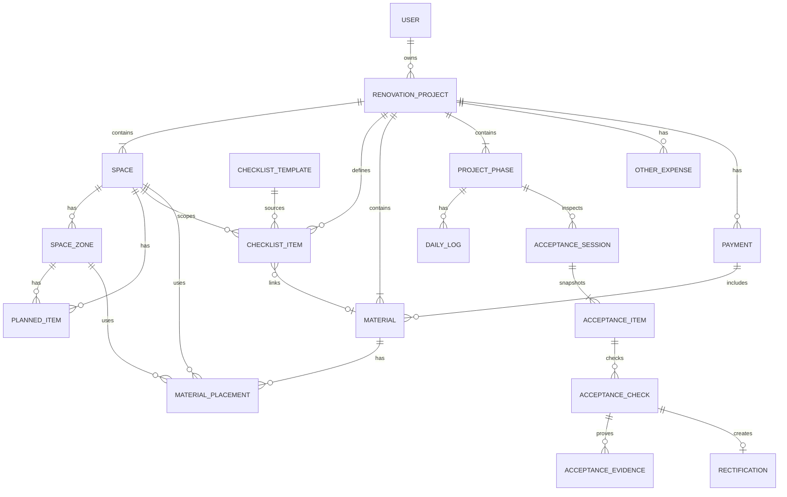

# 业主装修管理系统 — 产品需求文档 (PRD)

> 文档修订版：r1.3 | 目标产品版本：v1.0 | 日期：2026-07-20 | 状态：Active
>
> r1.3 变更：扩充 §3.3 全屋与分空间装修注意事项模板，增加风险等级、必验标记、验证方式与模板初始化规则。
>
> 上一版归档：[`docs/archive/PRD-v1.0-2026-07-06.md`](./archive/PRD-v1.0-2026-07-06.md)

---

## 1. 产品概述

### 1.1 背景与目标

业主装修管理系统（以下简称 **Reno**）是一个面向**业主本人**的装修管理工具，帮助业主在装修全过程中系统化地管理空间规划、装修注意事项、建材采购、成本预算与施工进度。

**核心目标：**

- 业主能够系统化规划每个房间的装修方案与注意事项，避免遗漏
- 清晰管理建材采购清单，明确每样建材用在哪里、买了多少、花了多少钱
- 多维度统计装修成本（按空间/品类/阶段），掌控预算不超支
- 记录施工进度与验收情况，装修过程有据可查

### 1.2 用户角色

| 角色               | 说明                                           |
| ------------------ | ---------------------------------------------- |
| **业主**           | 系统唯一用户（v1.0），管理自己的装修项目全流程 |
| **协作者（v1.2）** | 业主邀请的家人或设计师；**v1.0 不实现**        |

> 本系统为业主个人工具，非物业公司 SaaS 平台。无物业审批、巡检、违规等管理环节。v1.0 不做多角色权限。

### 1.3 核心价值

| 价值点     | 说明                                           |
| ---------- | ---------------------------------------------- |
| **不遗漏** | 内置各房间装修注意事项模板，系统化避免踩坑     |
| **买得清** | 建材清单管理，明确要买什么、用在哪里、花多少钱 |
| **花得明** | 多维度成本统计，按空间/品类/阶段随时掌握花费   |
| **管得住** | 施工进度与验收记录，装修过程透明可控           |

### 1.4 MVP 边界（v1.0 必做 / 延后）

> 原则：**先保证“算得准、录得进、看得清”**，再做图表、协作、智能化。

#### 必做（v1.0）

| 能力     | 范围说明                                                               |
| -------- | ---------------------------------------------------------------------- |
| 认证     | 注册 / 登录 / 刷新 Token；仅业主本人                                   |
| 项目管理 | 多项目支持；创建 / 编辑 / 归档 / 删除；项目概览                        |
| 空间规划 | 空间 + 分区；模板一键初始化；**不含**复杂图纸管理                      |
| 注意事项 | 全屋 / 按空间管理 + 内置模板；可关联阶段 / 建材                        |
| 建材管理 | 清单 + 使用位置 + 采购状态；删除空间时有关联约束                       |
| 成本管理 | 预算 vs 实际对比 + 超支预警；费用来源以**建材实际花费 + 款项已付**为主 |
| 施工进度 | 阶段管理 + 施工日志（文字 + 照片）                                     |
| 验收     | 阶段验收（从注意事项生成检查项）；通过 / 需整改                        |
| 通知     | **仅首页待办 / 预警卡片**（不做完整消息中心）                          |

#### 明确延后

| 能力                     | 版本 | 说明                                 |
| ------------------------ | ---- | ------------------------------------ |
| 甘特图 / 时间线 / 照片墙 | v1.1 | 视图增强                             |
| 成本可视化图表           | v1.1 | 饼图 / 柱状图 / 趋势图               |
| 装修知识库               | v1.1 | 独立内容模块                         |
| 浏览器推送               | v1.1 | 站内卡片已够用                       |
| 完整站内消息中心         | v1.1 | MVP 用首页待办替代                   |
| 款项台账精细化           | v1.1 | MVP 只保留“已付金额计入实际花费”     |
| 数据导出 PDF / Excel     | v1.1 | —                                    |
| 协作者（家人 / 设计师）  | v1.2 | v1 **不做权限协作**，避免半吊子 RBAC |
| 智能推荐 / 用量估算      | v2.0 | 远期                                 |

#### 默认决策（关闭开放问题）

| 议题       | 默认结论                           |
| ---------- | ---------------------------------- |
| 移动端 App | **不做原生 App**；Web 响应式即可   |
| 多项目     | **支持**；业主可管理多套房装修     |
| 协作者     | **v1 不做**；仅业主本人            |
| 数据导出   | **v1.1** 做 Excel / PDF            |
| 建材模板库 | **预置常用品类**；不预置全量商品库 |

---

## 2. 核心业务流程

### 2.1 装修准备流程

```
业主创建装修项目（设定地址、风格、预算、工期）
    ↓
创建空间规划（客厅/主卧/厨房/卫生间/阳台...）
    ↓
每个空间内划分分区（如厨房：台面区/烹饪区/洗涤区/储物区）
    ↓
规划家具家电（每个空间/分区放什么、尺寸、预算）
    ↓
从模板初始化装修注意事项 + 自定义补充
    ↓
关联注意事项与建材（如"厨房台面"→ 石英石板材）
```

### 2.2 建材采购流程

```
建立建材清单（名称/品类/规格/品牌/数量/预估价）
    ↓
为每样建材标注使用位置（哪个空间/哪个分区/什么用途）
    ↓
采购状态跟踪：待购 → 已购 → 已到货 → 已安装
    ↓
记录实际采购单价，系统自动计算实际总价
    ↓
费用自动归入成本统计
```

### 2.3 施工与验收流程

```
制定施工计划（拆改→水电→泥木→油漆→安装→软装→保洁）
    ↓
各阶段施工 → 记录施工日志 + 照片
    ↓
阶段完工 → 业主自查验收（对照注意事项清单）
    ↓
全部完工 → 整体回顾与归档
```

### 2.4 成本管理流程

```
设定项目总预算
    ↓
各费用自动/手动归集（建材采购费 + 人工费 + 设计费 + 家具家电费 + 软装费）
    ↓
多维度统计：按空间 / 按品类 / 按阶段 / 按采购状态
    ↓
预算 vs 实际对比 → 超预算预警
    ↓
款项台账：记录付给施工方的各期进度款
```

### 2.5 领域状态字典（v1.0 唯一规范）

> 本节是产品状态与枚举的唯一事实来源。数据库、`@reno/shared`、API 与 UI 必须使用相同的英文值；中文仅作界面文案。枚举常量采用大写蛇形命名（如 `PROJECT_STATUS`），持久化值沿用仓库既有的小写 `snake_case`。所有流转由后端校验，前端仅展示合法操作。

#### 2.5.1 项目生命周期 `ProjectStatus`

采购与施工可以并行，因此不再将 `purchasing` / `constructing` 作为互斥的项目状态；采购进度由建材状态派生，施工进度由阶段状态派生。

```
planning（规划中） → active（进行中） → accepting（验收中） → done（已完工） → archived（已归档）
                         ↑                    │
                         └──── 有整改 ────────┘
```

| 枚举值      | 中文文案 | 允许迁移到        | 进入条件                                                 |
| ----------- | -------- | ----------------- | -------------------------------------------------------- |
| `planning`  | 规划中   | `active`          | 业主主动启动项目；至少存在 1 个空间和 1 个施工阶段       |
| `active`    | 进行中   | `accepting`       | 所有阶段已完成、所有必验阶段均通过，且业主发起完工确认   |
| `accepting` | 完工确认 | `active` / `done` | 发现新整改则回 `active`；业主确认无遗留问题后进入 `done` |
| `done`      | 已完工   | `archived`        | 业主确认完工                                             |
| `archived`  | 已归档   | —                 | 只读终态；业务写操作统一返回 `PROJECT_ARCHIVED`          |

- 创建建材、更新采购状态不会自动改变项目生命周期。
- 阶段验收发生在 `active` 内，不改变项目生命周期；项目进度、采购进度均为派生指标。
- MVP 不支持从 `archived` 恢复；后续若支持，必须作为独立需求评审。

#### 2.5.2 建材采购状态 `MaterialStatus`

| 枚举值      | 中文文案 | 允许迁移到  | 业务约束                                                          |
| ----------- | -------- | ----------- | ----------------------------------------------------------------- |
| `todo`      | 待购     | `bought`    | 可填写计划数量与预估单价                                          |
| `bought`    | 已购     | `arrived`   | 必须填写 `actualQty`、`actualUnitPrice`；视为已支付并计入实际花费 |
| `arrived`   | 已到货   | `installed` | 已到货但尚未安装                                                  |
| `installed` | 已安装   | —           | 正常终态                                                          |

- 正常操作仅允许向前推进；回退必须二次确认、填写原因并记录操作日志。
- 若发生退货，不通过状态回退冲减金额，而是记录 `refundAmount`；完全退货后可确认回到 `todo`。
- MVP 中 `bought` 表示该建材行的计划采购已经完成；分批采购用多条建材行表达，采购批次子表延后。

#### 2.5.3 施工阶段状态 `StageStatus`

| 枚举值    | 中文文案 | 允许迁移到         | 业务约束                                       |
| --------- | -------- | ------------------ | ---------------------------------------------- |
| `pending` | 未开始   | `ongoing`          | 默认状态                                       |
| `ongoing` | 进行中   | `pending` / `done` | 同一项目同时只允许 1 个 `ongoing` 主阶段       |
| `done`    | 已完成   | `ongoing`          | 完工不等于验收通过；验收结果由验收批次独立表达 |

- `ongoing → pending`、`done → ongoing` 均视为回退，必须二次确认并记录原因。
- 阶段验收状态由该阶段最新验收批次派生，不增加 `accepted` 阶段状态。

#### 2.5.4 注意事项状态 `NoteStatus`

| 枚举值      | 中文文案 | 允许迁移到          |
| ----------- | -------- | ------------------- |
| `todo`      | 待确认   | `confirmed`         |
| `confirmed` | 已确认   | `done` / `need_fix` |
| `need_fix`  | 需整改   | `confirmed`         |
| `done`      | 已完成   | `confirmed`         |

#### 2.5.5 家具家电状态 `PlannedItemStatus`

| 枚举值      | 中文文案 | 允许迁移到  |
| ----------- | -------- | ----------- |
| `todo`      | 待购     | `bought`    |
| `bought`    | 已购     | `installed` |
| `installed` | 已安装   | —           |

家具家电规划本身不直接产生项目成本；实际采购应关联或新建独立建材、款项或其他费用，避免同一金额重复计入。

#### 2.5.6 款项状态 `PaymentStatus`

| 枚举值    | 中文文案 | 判定规则                         |
| --------- | -------- | -------------------------------- |
| `pending` | 待付     | `paidAmount = 0`                 |
| `partial` | 部分支付 | `0 < paidAmount < payableAmount` |
| `paid`    | 已付清   | `paidAmount = payableAmount`     |

`paidAmount` 不得小于 0 或大于 `payableAmount`；状态由金额自动派生，不允许手工选择。

#### 2.5.7 验收状态

**验收批次 `AcceptanceSessionStatus`**

| 枚举值       | 中文文案 | 允许迁移到                 |
| ------------ | -------- | -------------------------- |
| `draft`      | 草稿     | `inspecting` / `cancelled` |
| `inspecting` | 验收中   | `need_fix` / `passed`      |
| `need_fix`   | 待整改   | `inspecting` / `cancelled` |
| `passed`     | 已通过   | —                          |
| `cancelled`  | 已取消   | —                          |

**验收项检查结果 `AcceptanceCheckResult`**：`passed`（通过）/ `failed`（不通过）。未产生检查记录即为“待检查”，不额外持久化 `pending` 结果。

#### 2.5.8 预算健康度 `BudgetHealth`

| 枚举值          | 中文文案 | 判定规则                                    |
| --------------- | -------- | ------------------------------------------- |
| `ok`            | 正常     | 实际花费率 < 80%，且预测总额未达到预算      |
| `warn`          | 接近预算 | 80% ≤ 实际花费率 < 100%，且预测总额未超预算 |
| `forecast_over` | 预计超支 | 实际花费未超预算，但预测总额 ≥ 项目总预算   |
| `over`          | 已超支   | 实际花费 ≥ 项目总预算                       |

判定优先级为 `over` → `forecast_over` → `warn` → `ok`。

### 2.6 预算与实际花费计算规则

> 前后端必须使用 `@reno/shared` 中同一套以“分”为单位的整数纯函数。数据库金额可使用 `DECIMAL(12,2)`，进入计算函数前统一转为分，禁止使用浮点金额直接累计。

#### 2.6.1 费用来源与防重复规则

MVP 允许三类费用来源：

| 来源                     | 说明                               | 是否计入项目汇总 |
| ------------------------ | ---------------------------------- | ---------------- |
| 独立建材 `material`      | 业主单独采购、未包含在工程合同款中 | 计入             |
| 款项 `payment`           | 支付给施工方 / 设计方 / 其他收款方 | 计入             |
| 其他费用 `other_expense` | 不属于上述两类的已发生费用         | 计入             |

每条建材增加 `costMode`：

- `standalone`：独立采购，参与项目总额计算。
- `included_in_payment`：已包含在某笔工程款中，仅用于建材分析，**不得再次计入**项目总额；必须关联 `includedPaymentId`。

同一笔经济支出只能有一个汇总来源。服务端必须拒绝缺少关联款项的 `included_in_payment` 建材，以及跨项目关联。按空间 / 品类查看时可展示包含项的参考金额，但必须标记“已含在合同款中”，且不得与总额相加。

家具家电规划中的 `budgetPrice` 仅用于方案参考，不直接进入项目成本汇总；需要纳入预算时，业主必须将其关联为独立建材或款项。家具家电实际支出通过独立建材、款项或 `other_expense` 三者之一记录。

#### 2.6.2 指标定义

| 指标                          | 计算公式                                             | 说明                   |
| ----------------------------- | ---------------------------------------------------- | ---------------------- |
| 项目总预算 `totalBudget`      | 业主手动设定                                         | 唯一预算上限           |
| 实际花费 `actualSpent`        | `Σ 独立建材实际总价 + Σ 款项已付 + Σ 其他费用`       | 已经发生且不重复的支出 |
| 剩余承诺 `remainingCommitted` | `Σ 待购独立建材预估总价 + Σ max(款项应付 - 已付, 0)` | 已计划但尚未支出的金额 |
| 预测总额 `forecastTotal`      | `actualSpent + remainingCommitted`                   | 按当前计划预计最终花费 |
| 现金剩余 `cashRemaining`      | `totalBudget - actualSpent`                          | 尚未实际花出的预算     |
| 可用预算 `availableBudget`    | `totalBudget - forecastTotal`                        | 扣除承诺后的可调整预算 |
| 实际花费率 `spendRatio`       | `actualSpent / totalBudget`                          | 判断已发生支出风险     |
| 预测花费率 `forecastRatio`    | `forecastTotal / totalBudget`                        | 判断预计超支风险       |

- `totalBudget = 0` 时两个比率均返回 0，同时提示“尚未设置预算”，不得显示为预算健康。
- 所有汇总结果必须同时返回明细来源计数与未分配金额，便于追溯。

#### 2.6.3 建材金额

- 预估总价 `estimatedTotal = plannedQty × estimatedUnitPrice`。
- 实际总价 `actualTotal = actualQty × actualUnitPrice + shippingAmount - discountAmount - refundAmount`。
- `todo` 且 `costMode = standalone` 时，预估总价计入 `remainingCommitted`。
- `bought / arrived / installed` 且 `costMode = standalone` 时，实际总价计入 `actualSpent`，不再同时计入剩余承诺。
- `actualQty`、单价和调整金额均不得为负；`discountAmount + refundAmount` 不得使实际总价小于 0。
- MVP 使用建材行的聚合实际数量和金额；分批采购明细延后，但修改必须保留操作日志。

#### 2.6.4 款项与其他费用

- 款项包含 `payableAmount`、`paidAmount`、`payeeType`、`paidDate?`；状态按 §2.5.6 自动派生。
- `paidAmount` 计入 `actualSpent`；`max(payableAmount - paidAmount, 0)` 计入 `remainingCommitted`。
- 其他费用只记录已经发生的金额并计入 `actualSpent`；尚未发生的杂费应作为独立建材计划或款项计划记录。
- 删除或减少已付金额属于敏感操作，必须二次确认并记录原值、新值与原因。

#### 2.6.5 多维度分摊

- 独立建材按 `MaterialPlacement.usageQuantity / Material.actualQty` 分摊到空间；未分配部分计入“未分配”。
- 一件建材可分配到多个空间，但各位置用量合计不得超过 `actualQty`；`todo` 状态按 `plannedQty` 校验。
- 款项和其他费用可选关联空间、阶段和品类；未关联时计入对应维度的“未分配”。
- `included_in_payment` 建材只用于分析分摊，不参与项目汇总；界面必须避免把分摊参考金额与实际总额相加。

#### 2.6.6 预警规则

| 健康度          | 条件                                          | 表现                     |
| --------------- | --------------------------------------------- | ------------------------ |
| `ok`            | `spendRatio < 0.8` 且 `forecastRatio < 1`     | 绿色                     |
| `warn`          | `0.8 ≤ spendRatio < 1` 且 `forecastRatio < 1` | 黄色预警                 |
| `forecast_over` | `spendRatio < 1` 且 `forecastRatio ≥ 1`       | 橙色“按当前计划预计超支” |
| `over`          | `spendRatio ≥ 1`                              | 红色“已经超支”           |

#### 2.6.7 一致性约束

1. 建材使用位置的空间 / 分区必须属于**同一项目**。
2. 删除空间 / 分区：若存在关联建材位置、注意事项、家具 → **默认阻止删除**，提示先解绑或迁移。
3. 删除建材：级联删除其使用位置记录；已关联注意事项仅解除关联，不删注意事项；已有财务影响时改为停用，不允许物理删除。
4. 验收项从注意事项生成时保存内容快照；后续修改注意事项不得改写历史验收。
5. 项目 `archived` 后禁止业务写操作；认证刷新与读取不受影响。
6. 跨项目关联、重复计费、金额为负、用量超分配、非法状态迁移必须由服务端拒绝。

---

## 3. 功能模块详细设计

### 3.1 项目管理

#### 3.1.1 装修项目

- **创建项目**
  - 项目名称、房屋地址
  - 装修类型：全包 / 半包 / 清包
  - 装修风格（现代简约/北欧/日式/轻奢/...）
  - 装修范围：全屋 / 局部（勾选区域）
  - 总预算设定
  - 预计工期：开工日期 ~ 竣工日期

- **项目概览**
  - 项目生命周期：见 §2.5.1（planning / active / accepting / done / archived）
  - 基本信息：地址、类型、风格、工期
  - 进度总览：当前阶段、已完成阶段数 / 阶段总数；阶段内百分比由业主手工维护
  - 预算总览：总预算、实际花费、预测总额、可用预算、预算健康度（计算规则见 §2.6）
  - 采购总览：建材总数、已购数、待购数
  - **首页待办卡片**：待购建材、逾期阶段、预算预警、待验收项

- **多项目**：业主可创建并切换多个装修项目（每套房一个）
- **归档与删除**：`done → archived` 后只读；MVP 不提供项目物理删除，误建且没有任何业务数据的项目可在二次确认后删除

### 3.2 空间规划管理

#### 3.2.1 空间管理

- **空间分类**：预设常用空间模板（客厅、餐厅、主卧、次卧、厨房、卫生间、阳台等）
- **自定义空间**：业主可新增自定义空间（如书房、储藏室、衣帽间）
- **空间属性**：
  - 空间名称、面积
  - 装修风格/用途备注
  - 空间照片
  - 关联设计图纸（可选）

#### 3.2.2 空间内分区规划

- 每个空间内可划分多个**分区**（如厨房：台面区、烹饪区、洗涤区、储物区）
- 分区属性：名称、位置描述、尺寸（长×宽×高）、规划说明
- 分区可关联家具家电和建材
- **删除约束**：存在关联建材位置 / 注意事项 / 家具时，默认**阻止删除**（见 §2.6.7）

#### 3.2.3 家具家电规划

- 在空间或分区内规划家具家电
- 属性：名称、品类、品牌、型号、尺寸、预算单价、状态
- 可关联建材（如"定制衣柜"关联"板材"）
- 状态：待购 / 已购 / 已安装

### 3.3 装修注意事项管理

#### 3.3.1 注意事项维度

- 支持按**全屋通用**或**空间维度**管理装修注意事项；全屋项不强制关联空间
- 每条注意事项包含：
  - 所属项目、所属空间（全屋通用项可为空）
  - 类别（插座/灯光/水路/防水/收纳/布局/动线/...）
  - 事项内容
  - **避坑提醒**（可选，常见陷阱提示）
  - 风险等级：低 / 中 / 高
  - 验证方式（可选，如拍照留档、尺寸复核、通水测试）
  - 是否必验：高风险模板项默认必验
  - 状态：待确认 / 已确认 / 已完成 / 需整改
  - 关联建材（可选，如"台面石英石"）
  - 关联施工阶段（可选）

字段命名统一如下：

| 属性名   | 变量名                 | 类型 / 枚举           | 说明                                   |
| -------- | ---------------------- | --------------------- | -------------------------------------- |
| 风险等级 | `riskLevel`            | `low / medium / high` | 高风险项默认进入阶段验收               |
| 是否必验 | `isAcceptanceRequired` | Boolean               | 系统模板可预设，业主可调整             |
| 验证方式 | `verificationMethod`   | Text                  | 描述如何确认完成，不存最终验收结果     |
| 来源模板 | `sourceTemplateId`     | UUID?                 | 仅用于追溯来源；项目实例与模板相互独立 |
| 避坑提醒 | `pitfallTip`           | Text?                 | 解释常见错误及后果                     |

风险等级不是质量结论：`high` 表示一旦遗漏可能涉及人身安全、结构、电气、燃气、防水或较高返工成本；最终做法必须以设计图、产品说明及项目所在地现行规范为准。

#### 3.3.2 预设模板

模板用于提醒与验收准备，不替代设计、施工交底或专业检测。系统首批内置以下项目级通用项：

> 模板发布和更新前，产品维护人应通过[国家标准全文公开系统](https://openstd.samr.gov.cn/)及项目所在地主管部门渠道复核适用要求，并记录复核日期；不得把可能变化的经验参数硬编码成全国统一强制值。

| 类别     | 阶段   | 风险 | 注意事项                                         | 验证方式 / 避坑提醒                                          |
| -------- | ------ | ---- | ------------------------------------------------ | ------------------------------------------------------------ |
| 结构     | 拆改   | 高   | 开工前确认承重墙、梁柱、剪力墙及公共管线位置     | 对照原始结构图和审批要求；不凭现场经验擅自拆改               |
| 结构     | 拆改   | 高   | 门洞、墙体和楼板开孔方案先确认                   | 记录位置与尺寸；涉及结构或公共设施时由专业人员确认           |
| 尺寸     | 规划   | 中   | 水电定位前锁定主要家具、家电和定制柜尺寸         | 用尺寸清单逐项复核，避免插座、风口、柜门冲突                 |
| 电气     | 水电   | 高   | 回路、线径、保护装置和设备供电要求按设计配置     | 保存配电回路表与测试记录；不以模板中的经验参数代替电气设计   |
| 电气     | 水电   | 高   | 强弱电点位、线路走向和封槽前照片留档             | 封闭前拍摄全景与近景，并标记墙面尺寸参考                     |
| 给排水   | 水电   | 高   | 给水改造完成后按约定方案进行压力与渗漏检查       | 保存测试条件、结果和照片；异常处理完成后重新检查             |
| 防水     | 泥木   | 高   | 防水基层、节点加强、门口收口和闭水/淋水检查      | 时长和做法以产品及当地规范为准；留存开始、结束及楼下检查记录 |
| 燃气     | 安装   | 高   | 燃气管道、阀门、通风和燃具安装由合规专业人员处理 | 不私改、包封或遮挡阀门；完工后按当地要求检查                 |
| 隐蔽工程 | 水电   | 高   | 水、电、暖、空调等隐蔽工程封闭前完成检查         | 未检查不得封闭；图纸、照片、测试记录关联到对应阶段           |
| 地面墙面 | 泥木   | 中   | 铺贴前确认排版、起铺点、对缝和收口方案           | 先做排版预览；重点检查窄条、阴阳角、门口和可视区域           |
| 涂装     | 油漆   | 中   | 基层含水、平整度、裂缝处理及颜色样板先确认       | 大面积施工前确认小样；不同光线下检查颜色                     |
| 成品保护 | 全阶段 | 中   | 门窗、地面、洁具、柜体和设备按阶段做好保护       | 每阶段交接拍照；明确损坏责任，避免交叉施工造成返工           |
| 环保     | 完工   | 中   | 材料资料、通风计划和入住前环境检查               | 保留材料资料；检测需求和入住时间根据家庭成员情况专业评估     |

分空间模板如下：

| 空间     | 类别     | 阶段 | 风险                                         | 注意事项                                               | 验证方式 / 避坑提醒                                    |
| -------- | -------- | ---- | -------------------------------------------- | ------------------------------------------------------ | ------------------------------------------------------ |
| 玄关     | 收纳     | 规划 | 低                                           | 鞋柜容量、换鞋区、常用物品和通风方式提前规划           | 按家庭成员和鞋型核对层高，避免只看外观不看容量         |
| 玄关     | 电气     | 水电 | 中                                           | 门口照明、备用插座和智能门锁供电方式确认               | 结合柜体和门套复核点位，确保设备可维护                 |
| 客厅     | 插座网络 | 水电 | 中                                           | 沙发、电视、音响、路由器和清洁设备点位统一规划         | 用家具尺寸落位，避免插座被遮挡或弱电设备无散热空间     |
| 客厅     | 灯光     | 水电 | 中                                           | 主照明、氛围照明和分控场景在施工前确认                 | 结合层高、观看位置与回路复核，不默认套用“无主灯”方案   |
| 客厅     | 空调窗帘 | 水电 | 中                                           | 空调、风口、检修口、窗帘盒和柜体避免相互冲突           | 用顶面综合图检查安装和检修空间                         |
| 客厅     | 动线     | 规划 | 中                                           | 家具摆放后保留连续通行与开门空间                       | 在平面图标注实际家具尺寸，并模拟柜门、房门完全开启     |
| 餐厅     | 布局     | 规划 | 低                                           | 餐桌尺寸、座位拉出空间及餐边柜深度提前确认             | 模拟满座和通行状态，避免餐边柜或冰箱影响动线           |
| 餐厅     | 插座     | 水电 | 中                                           | 餐边柜、小家电和临时用电点位按使用习惯设置             | 地插需评估清洁、绊倒和进水风险，不作为默认方案         |
| 卧室     | 开关插座 | 水电 | 中                                           | 床、床头柜、衣柜和梳妆台尺寸确定后定位                 | 同时检查双控、充电、空调和柜门开启，避免点位被家具遮挡 |
| 卧室     | 空调     | 水电 | 中                                           | 室内机、冷凝水、窗帘和衣柜位置综合确认                 | 检查排水条件、检修空间和送风方向                       |
| 卧室     | 收纳     | 木作 | 中                                           | 衣柜内部按长衣、短衣、叠放、抽屉和行李分区             | 按真实物品尺寸确认，不只按平均模板生成                 |
| 书房     | 网络照明 | 水电 | 中                                           | 书桌、显示器、打印机、网络和工作照明统一规划           | 核对插座数量、网口位置、眩光与后续设备扩展             |
| 厨房     | 布局     | 规划 | 高                                           | 冰箱、备餐、水槽、灶具和出餐动线综合规划               | 按房型和使用习惯复核，不机械套用固定距离               |
| 厨房     | 尺寸     | 规划 | 高                                           | 橱柜下单前确认所有嵌入式设备型号与散热要求             | 使用厂家开孔和安装尺寸，检查柜门、抽屉、管线和设备冲突 |
| 厨房     | 电气     | 水电 | 高                                           | 台面及固定设备供电按设备功率和电气设计配置             | 设备清单逐项复核；插座远离热源、明火和易积水位置       |
| 厨房     | 给排水   | 水电 | 高                                           | 水槽、净水器、洗碗机等进排水和检修空间提前确认         | 安装前通水检查；阀门、滤芯和排水连接必须可维护         |
| 厨房     | 烟道燃气 | 安装 | 高                                           | 烟道止回、排烟路径、燃气阀门与通风条件专业确认         | 不擅改公共烟道和燃气设施；点火、检漏由合规人员完成     |
| 卫生间   | 防水     | 泥木 | 高                                           | 墙地面防水范围、节点加强和门口收口按方案施工           | 防水高度、厚度和遍数以设计、产品及当地规范为准         |
| 卫生间   | 排水     | 泥木 | 高                                           | 地漏位置、排水坡向和干湿区高差提前确认                 | 铺贴后进行通水和积水检查，避免仅用目测判断坡度         |
| 卫生间   | 电气     | 水电 | 高                                           | 潮湿区域插座、照明、取暖和保护措施按设计设置           | 检查防护、接地和保护装置；位置以当地现行规范为准       |
| 卫生间   | 洁具     | 安装 | 中                                           | 马桶、花洒、浴室柜和镜柜尺寸及检修空间确认             | 检查开门、抽屉、上下水、插座和人体使用空间             |
| 卫生间   | 防滑     | 泥木 | 高                                           | 地面材料、防滑和无障碍需求结合家庭成员选择             | 有老人儿童时提高风险等级，完工后做实际湿态使用检查     |
| 阳台     | 防水排水 | 泥木 | 高                                           | 洗衣区防水、地漏、排水条件及与室内门口关系确认         | 通水并检查渗漏、倒坡和返水；不得擅接不允许的排水系统   |
| 阳台     | 门窗     | 安装 | 高                                           | 外窗、封阳台和栏杆改造遵守物业及当地管理要求           | 检查固定、密封和淋水表现；不擅自拆改安全防护构件       |
| 阳台     | 洗衣设备 | 水电 | 中                                           | 洗衣机、烘干机、热水和收纳设备尺寸点位确认             | 核对叠放固定、散热、排水、检修和柜门开启空间           |
| 全屋门窗 | 安装     | 中   | 门窗开启方向、门吸、五金和地面完成面关系确认 | 逐樘开关检查，确认无碰撞、异响、明显漏风漏水和安装松动 |
| 全屋定制 | 木作     | 中   | 下单前复尺并核对插座、踢脚线、门套和检修口   | 使用最终完成面尺寸；水电点位变化后必须重新复核         |
| 暖通地暖 | 水电     | 高   | 设备、管线、温控、冷凝水及检修条件综合确认   | 隐蔽前完成约定测试并拍照；地面施工遵守系统厂家要求     |

#### 3.3.3 模板管理

- 系统维护全屋模板、空间模板和注意事项模板库。
- 业主可按户型、装修范围和家庭特征（老人 / 儿童 / 宠物）选择性初始化；系统不得默认添加与项目无关的高风险项。
- 初始化前展示将新增、跳过和可能重复的条目；用户确认后创建项目实例。
- 项目实例保留 `sourceTemplateId`，但后续增删改与系统模板相互独立；系统模板升级不得覆盖用户内容或状态。
- 高风险模板项默认 `isAcceptanceRequired = true`，且必须关联施工阶段和验证方式；用户取消必验时需二次确认。
- 模板条目按稳定业务键去重，重复初始化不得静默创建副本。

### 3.4 建材管理

#### 3.4.1 建材清单

- **建材属性**：
  - 名称、品类（瓷砖/涂料/板材/五金/水电材料/门窗/...）
  - 品牌、规格、单位
  - 计划数量、预估单价、预估总价（自动计算）
  - 实际数量、实际单价、运费、优惠、退款、实际总价（自动计算）
  - 成本模式：独立采购 / 已包含在工程款；后者必须关联所属款项
  - 采购状态：见 §2.5.2（todo / bought / arrived / installed）
  - 采购渠道、采购链接
  - 备注
  - **规则**：进入 `bought` 及之后状态时，必须填写实际数量和实际单价

- **品类管理**：支持自定义建材品类，按品类分组查看；系统预置常用品类（瓷砖/涂料/板材/五金/水电材料/门窗等）

#### 3.4.2 建材使用位置管理

- 每样建材可标注**一个或多个使用位置**
- 使用位置属性：
  - 关联空间（如"厨房"）
  - 关联分区（可选，如"台面区"）
  - 具体位置描述（如"厨房台面"）
  - 该位置用量
  - 用途（地面铺贴/墙面/台面/吊顶/...）
- **约束**：空间 / 分区必须属于建材所在项目；位置用量不得超出计划或实际数量（见 §2.6.5）
- **反向查询**：查看某个空间/分区用到了哪些建材

#### 3.4.3 建材与注意事项关联

- 注意事项可关联建材（如"厨房台面用石英石"→ 关联"石英石板材"）
- 形成完整的 `注意事项 → 建材 → 使用位置` 链路

### 3.5 成本管理

> 金额计算与预警阈值统一见 **§2.6**。前后端共用同一套公式。

#### 3.5.1 费用来源（MVP）

MVP 实际花费由独立建材、款项和其他费用三类数据汇总。建材若已包含在工程款中，只参与建材维度分析，不重复计入项目总额。完整口径和校验规则见 §2.6。

#### 3.5.2 多维度成本统计

- **按空间统计**：客厅花了多少、厨房花了多少...
- **按品类统计**：建材类、人工类、设计费...
- **按阶段统计**：拆改阶段、水电阶段...
- **按采购状态统计**：已花费 vs 剩余承诺
- **预算对比**：总预算 vs 实际花费 vs 预测总额 vs 可用预算；超预算预警（§2.6.6）
- 每个维度均展示“未分配”，总额必须与项目汇总可对账
- 可视化图表：饼图 / 柱状图 / 趋势图（**v1.1**）

#### 3.5.3 款项台账

- 记录付给装修公司/施工方的各期进度款
- 属性：付款节点名称、期次、收款方类型、应付金额、已付金额、实付日期；状态按金额自动派生（pending / partial / paid）
- **MVP**：支持增删改查 + 计入 §2.6 汇总；精细化节点模板与提醒放 **v1.1**
- 帮助业主跟踪工程款支付进度，避免多付/漏付

### 3.6 施工进度管理

#### 3.6.1 施工阶段管理

- 预设阶段模板：拆改 → 水电 → 泥木 → 油漆 → 安装 → 软装 → 保洁
- 每阶段：计划工期、实际工期、状态（见 §2.5.3）、进度百分比
- 支持自定义阶段
- 同一项目同时仅 1 个 `ongoing` 主阶段（MVP）
- 甘特图视图展示整体进度（**v1.1**）

#### 3.6.2 施工日志

- v1.0 仅由业主每日/不定期填写施工日志
  - 施工内容
  - 施工人员
  - 材料使用记录
  - 现场照片；视频上传延后 v1.1
  - 问题与风险
  - 下一步计划

#### 3.6.3 进度看板

- 实时查看施工进展、照片、日志
- 支持时间线视图和照片墙视图（v1.1）

### 3.7 验收管理

#### 3.7.1 阶段验收（业主自查）

- 业主对照注意事项清单进行自查验收。
- **检查项生成规则（MVP）**：默认从本阶段 `isAcceptanceRequired = true` 的注意事项生成内容、风险等级和验证方式快照；业主可勾选其他注意事项或手工增补；同一阶段同时只能有 1 个未结束验收批次。
- 注意事项后续修改不得覆盖已经生成的验收项快照。
- 每次检查都新增检查记录，不覆盖旧结果；检查失败时必须填写说明，可附照片，并自动生成一条待整改记录。
- 整改完成后先标记整改记录已解决，再对原验收项新增一次复验记录。
- 当所有验收项的最新检查均通过、且不存在未解决整改时，验收批次自动变为 `passed`。
- 检查清单示例：水电验收（打压测试、电路检测）、防水验收（闭水试验）、泥工验收（平整度、空鼓率）。

#### 3.7.2 验收数据模型（MVP）

| 实体                 | 关键字段                                                                                                                               | 说明                              |
| -------------------- | -------------------------------------------------------------------------------------------------------------------------------------- | --------------------------------- |
| `AcceptanceSession`  | `id, projectId, phaseId, status, startedAt, completedAt?, notes?`                                                                      | 一次阶段验收批次                  |
| `AcceptanceItem`     | `id, sessionId, sourceChecklistItemId?, contentSnapshot, categorySnapshot?, riskLevelSnapshot, verificationMethodSnapshot?, sortOrder` | 不可变的检查项快照                |
| `AcceptanceCheck`    | `id, itemId, round, result, notes?, inspectedAt`                                                                                       | 每次初验 / 复验结果；只追加不覆盖 |
| `AcceptanceEvidence` | `id, checkId, photoUrl, caption?, createdAt`                                                                                           | 某次检查的照片证据                |
| `Rectification`      | `id, failedCheckId, description, status(open/resolved), resolvedAt?, resolutionNotes?`                                                 | 由失败检查产生的整改记录          |

约束：

1. `AcceptanceItem`、来源注意事项、阶段和项目必须属于同一项目。
2. `AcceptanceCheck.round` 在同一验收项内从 1 递增，服务端生成，客户端不得指定。
3. `failed` 检查必须有说明或至少一张证据照片；同一失败检查最多生成一条整改记录。
4. 有 `open` 整改时，验收批次不能通过。
5. 已通过或已取消的验收批次只读；纠错需创建新批次，不直接篡改历史。

#### 3.7.3 完工确认与竣工回顾

- 所有施工阶段均为 `done`，且所有必验阶段均存在最新的 `passed` 验收批次后，才允许项目进入 `accepting`。
- `accepting` 是轻量完工确认，不另建竣工验收批次；业主确认没有遗留问题后进入 `done`，发现问题则退回 `active` 并创建整改或补充阶段。
- 综合竣工回顾报告与独立竣工验收批次放在 **v1.1**。
- 项目完成后可执行 `done → archived`。

### 3.8 通知与消息

#### MVP（v1.0）：首页待办 / 预警卡片

- 待购建材（数量 + 入口）
- 工期提醒（阶段逾期 / 即将到期）
- 验收提醒（待验收阶段）
- 预算预警（接近 / 预计超支 / 已超支，见 §2.6.6）

> **不做**完整站内消息列表、已读未读、消息中心；避免范围膨胀。

首页卡片在请求时根据当前项目数据实时派生，MVP 不持久化 `Notification`，也不提供通知已读状态。

#### 后续

- 完整站内消息中心（**v1.1**）
- 浏览器推送（**v1.1**）

### 3.9 装修知识库（v1.1）

- 装修流程指南（各阶段做什么、注意什么）
- 建材选购指南（各类建材怎么选、价格区间）
- 避坑指南（常见装修陷阱与规避方法）
- 验收标准参考

### 3.10 MVP 验收标准

> 以下条目是 v1.0 的最小交付门槛。`Given / When / Then` 中的业务错误码必须稳定，不以中文提示作为自动化测试断言。

| ID          | Given（前置）                                | When（操作）                       | Then（可验收结果）                                                 |
| ----------- | -------------------------------------------- | ---------------------------------- | ------------------------------------------------------------------ |
| AUTH-01     | 未登录                                       | 访问任一项目业务接口               | 返回 `UNAUTHORIZED`，不泄露项目是否存在                            |
| AUTH-02     | 用户 A 已登录                                | 读取或修改用户 B 的项目资源        | 返回 `FORBIDDEN`；数据库无变化                                     |
| PROJ-01     | 新建项目                                     | 保存合法名称、地址、预算和工期     | 创建成功，状态为 `planning`，只出现在当前业主项目列表              |
| PROJ-02     | 项目没有空间或施工阶段                       | 尝试 `planning → active`           | 返回 `PROJECT_NOT_READY`，状态不变                                 |
| PROJ-03     | 项目为 `archived`                            | 调用任一业务写接口                 | 返回 `PROJECT_ARCHIVED`；数据与更新时间均不变化                    |
| PROJ-04     | 项目含任一业务数据                           | 请求永久删除                       | 返回 `PROJECT_DELETE_BLOCKED`；引导使用归档                        |
| SPACE-01    | 空间存在关联位置、注意事项或家具             | 删除空间                           | 返回 `SPACE_IN_USE`，并返回各类关联数量                            |
| SPACE-02    | 已从模板初始化                               | 再次执行模板初始化                 | 先返回差异预览；未经确认不得静默创建重复空间或事项                 |
| NOTE-01     | 初始化模板中存在高风险注意事项               | 用户确认初始化                     | 高风险项默认必验，且带施工阶段与验证方式                           |
| NOTE-02     | 项目实例已经从模板创建                       | 系统模板随后升级                   | 不覆盖实例内容、状态或必验设置；仅提示可选择新增的模板条目         |
| MATERIAL-01 | 建材为 `todo`，缺少实际数量或实际单价        | 更新为 `bought`                    | 返回 `MATERIAL_ACTUAL_COST_REQUIRED`                               |
| MATERIAL-02 | 建材与位置属于不同项目                       | 创建使用位置                       | 返回 `CROSS_PROJECT_REFERENCE`                                     |
| MATERIAL-03 | 位置用量合计将超过计划或实际数量             | 保存位置                           | 返回 `MATERIAL_USAGE_EXCEEDED`，并返回可分配余量                   |
| COST-01     | 建材标记 `included_in_payment`               | 计算项目成本                       | 该建材不重复计入项目总额，仍可在建材分析中看到“已含在合同款”       |
| COST-02     | 同一组固定输入                               | 前端预览和服务端计算预算           | `actualSpent`、`forecastTotal`、`availableBudget` 与健康度完全一致 |
| COST-03     | `totalBudget = 0`                            | 查看项目概览                       | 比率返回 0，显示“尚未设置预算”，不显示绿色健康状态                 |
| PAYMENT-01  | `payableAmount = 10000`、`paidAmount = 3000` | 保存款项                           | 状态自动为 `partial`；7000 计入 `remainingCommitted`               |
| PHASE-01    | 项目已有一个 `ongoing` 主阶段                | 启动另一个主阶段                   | 返回 `ONGOING_STAGE_EXISTS`                                        |
| LOG-01      | 上传非 jpg/jpeg/png/webp 或超过 20MB 的文件  | 提交施工日志                       | 返回 `UPLOAD_FILE_INVALID`；日志不产生半完成记录                   |
| ACCEPT-01   | 阶段关联了注意事项                           | 创建验收批次                       | 生成内容快照；之后修改注意事项不改变该验收项                       |
| ACCEPT-02   | 某项检查失败                                 | 保存失败结果                       | 新增检查记录与一条 `open` 整改；旧检查记录仍可查询                 |
| ACCEPT-03   | 整改已解决                                   | 对同一验收项复验                   | 新增更高 `round` 的检查记录，不覆盖失败记录                        |
| ACCEPT-04   | 所有项最新检查均通过且无开放整改             | 完成本批次                         | 批次自动为 `passed`；阶段验收派生状态为已通过                      |
| ACCEPT-05   | 任一必验阶段没有通过                         | 将项目从 `accepting` 更新为 `done` | 返回 `REQUIRED_ACCEPTANCE_NOT_PASSED`                              |
| HOME-01     | 存在待购、逾期、待验收或预算风险数据         | 打开项目首页                       | 卡片由实时数据派生，数量与相应筛选后的列表一致                     |

---

## 4. 数据模型（核心实体）

```
User (用户)
├── id, username, passwordHash, name, phone, avatar
│
└── RenovationProject (装修项目)
    ├── id, ownerId, name, address
    ├── type, style, scope, totalBudget, plannedStart, plannedEnd
    ├── status (planning/active/accepting/done/archived)
    │
    ├── Space (装修空间)
    │   ├── id, projectId, name, area, styleNotes, photos[], designDocs[]
    │   ├── SpaceZone (空间分区)
    │   │   └── id, spaceId, name, position, dimensions, planNotes
    │   ├── PlannedItem (家具家电规划)
    │   │   └── id, spaceId, zoneId?, name, category, brand, model,
    │   │       dimensions, budgetPrice, status, linkedMaterialId?
    │
    ├── ChecklistItem (装修注意事项)
    │   └── id, projectId, spaceId?, category, content, pitfallTip?, riskLevel,
    │       verificationMethod?, isAcceptanceRequired, sourceTemplateId?, status,
    │       linkedMaterialId?, linkedPhaseId?
    │
    ├── Material (建材)
    │   ├── id, projectId, name, category, brand, spec, unit
    │   ├── plannedQty, estimatedUnitPrice
    │   ├── actualQty, actualUnitPrice, shippingAmount, discountAmount, refundAmount
    │   ├── costMode (standalone/included_in_payment), includedPaymentId?
    │   ├── status (todo/bought/arrived/installed), purchaseChannel, purchaseLink, notes
    │   └── MaterialPlacement (建材使用位置)
    │       └── id, materialId, spaceId, zoneId?, locationDesc, usageQuantity, purpose
    │
    ├── ProjectPhase (施工阶段)
    │   └── id, projectId, phaseName, sortOrder, isAcceptanceRequired,
    │       plannedStart, plannedEnd, actualStart, actualEnd, status, progressPercent
    │
    ├── DailyLog (施工日志)
    │   └── id, projectId, phaseId, authorId, content, materials, workers,
    │       photos[], tomorrowPlan, issues, createdAt
    │
    ├── AcceptanceSession (验收批次)
    │   ├── id, projectId, phaseId, status, startedAt, completedAt?, notes?
    │   └── AcceptanceItem (验收项快照)
    │       ├── id, sessionId, sourceChecklistItemId?, contentSnapshot,
    │       │   categorySnapshot?, sortOrder
    │       └── AcceptanceCheck (初验/复验记录)
    │           ├── id, itemId, round, result, notes?, inspectedAt
    │           ├── AcceptanceEvidence (证据)
    │           │   └── id, checkId, photoUrl, caption?, createdAt
    │           └── Rectification (整改)
    │               └── id, failedCheckId, description, status,
    │                   resolvedAt?, resolutionNotes?
    │
    ├── OtherExpense (其他费用)
    │   └── id, projectId, amount, category, spaceId?, phaseId?,
    │       payDate, payMethod, notes, createdAt
    │
    └── Payment (款项台账)
        └── id, projectId, nodeName, sequence, payeeType, payableAmount,
            paidAmount, paidDate?, spaceId?, phaseId?, category?, status
```

系统级 `ChecklistTemplate` 不属于任何用户项目，字段为：`id, stableKey, version, scopeType(project/space), spaceType?, category, content, pitfallTip?, riskLevel, verificationMethod?, isAcceptanceRequired, defaultPhaseKey?, audienceTags[], isActive, reviewedAt`。项目注意事项仅通过 `sourceTemplateId` 追溯来源，模板更新不级联覆盖实例。

> 首页待办和预算预警在 MVP 中实时派生，不建立 `Notification` 业务依赖；完整通知实体延后 v1.1。

---

## 5. API 设计

### 5.1 通用响应格式

```typescript
interface ApiResponse<T> {
  code: number; // 0=成功, 非0=错误码
  message: string;
  data: T;
}

interface PaginatedData<T> {
  list: T[];
  total: number;
  page: number;
  pageSize: number;
}
```

### 5.2 认证模块

| 方法 | 路径                      | 说明                      |
| ---- | ------------------------- | ------------------------- |
| POST | `/api/auth/register`      | 用户注册（用户名 + 密码） |
| POST | `/api/auth/login`         | 用户登录                  |
| POST | `/api/auth/token/refresh` | 刷新 JWT Token            |
| GET  | `/api/auth/me`            | 获取当前用户信息          |
| PUT  | `/api/auth/me`            | 更新用户信息              |

### 5.3 项目管理模块

| 方法   | 路径                        | 说明                         |
| ------ | --------------------------- | ---------------------------- |
| POST   | `/api/projects`             | 创建装修项目                 |
| GET    | `/api/projects`             | 获取项目列表                 |
| GET    | `/api/projects/:id`         | 获取项目详情（含概览统计）   |
| PUT    | `/api/projects/:id`         | 更新项目信息                 |
| POST   | `/api/projects/:id/status`  | 更新项目状态                 |
| POST   | `/api/projects/:id/archive` | 归档已完工项目               |
| DELETE | `/api/projects/:id`         | 仅删除没有业务数据的误建项目 |

### 5.4 空间规划模块

| 方法   | 路径                                          | 说明             |
| ------ | --------------------------------------------- | ---------------- |
| POST   | `/api/projects/:id/spaces`                    | 创建空间         |
| GET    | `/api/projects/:id/spaces`                    | 获取空间列表     |
| PUT    | `/api/spaces/:id`                             | 更新空间信息     |
| DELETE | `/api/spaces/:id`                             | 删除空间         |
| POST   | `/api/spaces/:id/zones`                       | 创建空间内分区   |
| GET    | `/api/spaces/:id/zones`                       | 获取分区列表     |
| PUT    | `/api/zones/:id`                              | 更新分区         |
| DELETE | `/api/zones/:id`                              | 删除分区         |
| POST   | `/api/spaces/:id/items`                       | 添加家具家电规划 |
| GET    | `/api/spaces/:id/items`                       | 获取家具家电列表 |
| PUT    | `/api/items/:id`                              | 更新家具家电     |
| DELETE | `/api/items/:id`                              | 删除家具家电     |
| POST   | `/api/projects/:id/spaces/init-from-template` | 从模板初始化空间 |

### 5.5 装修注意事项模块

| 方法   | 路径                                           | 说明                                                           |
| ------ | ---------------------------------------------- | -------------------------------------------------------------- |
| POST   | `/api/projects/:id/checklist`                  | 添加全屋或空间注意事项（`spaceId` 可选）                       |
| GET    | `/api/spaces/:id/checklist`                    | 获取空间注意事项列表                                           |
| GET    | `/api/projects/:id/checklist`                  | 获取项目全部注意事项（支持按空间/类别/风险/状态/是否必验筛选） |
| PUT    | `/api/checklist/:id`                           | 更新注意事项                                                   |
| PUT    | `/api/checklist/:id/status`                    | 更新注意事项状态                                               |
| DELETE | `/api/checklist/:id`                           | 删除注意事项                                                   |
| GET    | `/api/checklist-templates`                     | 查询适用模板（空间类型/阶段/风险/家庭特征）                    |
| POST   | `/api/projects/:id/checklist/template-preview` | 返回模板初始化差异，不写数据                                   |
| POST   | `/api/projects/:id/checklist/template-apply`   | 按预览确认结果创建项目注意事项实例                             |

### 5.6 建材管理模块

| 方法   | 路径                            | 说明                                     |
| ------ | ------------------------------- | ---------------------------------------- |
| POST   | `/api/projects/:id/materials`   | 添加建材                                 |
| GET    | `/api/projects/:id/materials`   | 获取建材列表（支持按品类/状态/空间筛选） |
| GET    | `/api/materials/:id`            | 获取建材详情（含使用位置）               |
| PUT    | `/api/materials/:id`            | 更新建材信息                             |
| PUT    | `/api/materials/:id/status`     | 更新采购状态                             |
| DELETE | `/api/materials/:id`            | 删除建材                                 |
| POST   | `/api/materials/:id/placements` | 添加建材使用位置                         |
| GET    | `/api/materials/:id/placements` | 获取建材使用位置列表                     |
| PUT    | `/api/placements/:id`           | 更新使用位置                             |
| DELETE | `/api/placements/:id`           | 删除使用位置                             |
| GET    | `/api/spaces/:id/materials`     | 查询空间使用的建材（反向查询）           |

### 5.7 成本管理模块

| 方法   | 路径                                         | 说明                                         |
| ------ | -------------------------------------------- | -------------------------------------------- |
| POST   | `/api/projects/:id/other-expenses`           | 添加其他已发生费用                           |
| GET    | `/api/projects/:id/other-expenses`           | 获取其他费用列表（支持按品类/空间/阶段筛选） |
| PUT    | `/api/other-expenses/:id`                    | 更新其他费用                                 |
| DELETE | `/api/other-expenses/:id`                    | 删除其他费用（记录操作日志）                 |
| GET    | `/api/projects/:id/cost-summary`             | 获取成本汇总（多维度统计）                   |
| GET    | `/api/projects/:id/cost-summary/by-space`    | 按空间维度统计                               |
| GET    | `/api/projects/:id/cost-summary/by-category` | 按品类维度统计                               |
| GET    | `/api/projects/:id/cost-summary/by-phase`    | 按阶段维度统计                               |
| POST   | `/api/projects/:id/payments`                 | 添加款项记录                                 |
| GET    | `/api/projects/:id/payments`                 | 获取款项列表                                 |
| PUT    | `/api/payments/:id`                          | 更新款项记录                                 |

### 5.8 施工阶段模块

| 方法 | 路径                       | 说明              |
| ---- | -------------------------- | ----------------- |
| POST | `/api/projects/:id/phases` | 创建/更新施工计划 |
| GET  | `/api/projects/:id/phases` | 获取阶段列表      |
| PUT  | `/api/phases/:id/status`   | 更新阶段状态      |
| POST | `/api/phases/:id/complete` | 标记阶段完工      |

### 5.9 施工日志模块

| 方法 | 路径                     | 说明                                |
| ---- | ------------------------ | ----------------------------------- |
| POST | `/api/projects/:id/logs` | 提交施工日志                        |
| GET  | `/api/projects/:id/logs` | 获取日志列表（支持按阶段/日期筛选） |
| POST | `/api/uploads/image`     | 上传图片（返回 URL）                |

### 5.10 验收模块

| 方法 | 路径                                    | 说明                             |
| ---- | --------------------------------------- | -------------------------------- |
| POST | `/api/projects/:id/acceptance-sessions` | 创建验收批次并生成检查项快照     |
| GET  | `/api/projects/:id/acceptance-sessions` | 获取项目验收批次列表             |
| GET  | `/api/acceptance-sessions/:id`          | 获取批次、检查项、历次检查与整改 |
| POST | `/api/acceptance-items/:id/checks`      | 新增初验 / 复验记录              |
| PUT  | `/api/rectifications/:id/resolve`       | 标记整改完成                     |
| POST | `/api/acceptance-sessions/:id/complete` | 完成验收；服务端校验全部通过     |
| POST | `/api/acceptance-sessions/:id/cancel`   | 取消未结束验收批次               |

---

## 6. 技术架构规划

### 6.1 Monorepo 结构

```
reno/
├── apps/
│   ├── web/          → 业主端 Web 应用（React 19 + shadcn/ui + Base UI）
│   ├── mobile/       → 移动端（可选，后期适配）
│   └── server/       → API 服务（Hono + TypeScript）
├── packages/
│   ├── shared/       → 共享 Zod schema、类型、枚举、常量
│   ├── utils/        → 通用工具函数
│   ├── db/           → 数据库 schema、迁移（Drizzle ORM）
│   └── ui/           → 共享 UI 组件（可选）
└── docs/
    └── PRD.md
```

### 6.2 技术选型

| 层       | 方案                                                         |
| -------- | ------------------------------------------------------------ |
| 前端     | React 19 + TypeScript + shadcn/ui（Base UI）+ Tailwind CSS 4 |
| 后端     | Hono + TypeScript                                            |
| 数据库   | PostgreSQL 17                                                |
| ORM      | Drizzle ORM                                                  |
| 校验     | Zod（前后端共享 schema，契约即代码）                         |
| 文件存储 | 本地存储（开发）/ 对象存储（生产，阿里云 OSS / MinIO）       |
| 认证     | JWT（用户名 + 密码，argon2id 哈希）                          |
| 部署     | Docker + 1Panel                                              |

> 详细技术架构与版本锁定见 `docs/ARCHITECTURE.md`。

---

## 7. 版本规划

### MVP (v1.0) — 核心可用

> 对齐 §1.4：算得准、录得进、看得清。

- [ ] 用户注册 / 登录 / Token 刷新（仅业主）
- [ ] 多项目管理（创建 / 编辑 / 归档 / 删除 / 切换）
- [ ] 项目状态机（§2.5.1）+ 概览（进度 / 预算 / 采购 / 待办卡片）
- [ ] 空间 + 分区；模板一键初始化；删除关联约束
- [ ] 家具家电规划（基础 CRUD）
- [ ] 注意事项（模板 + 自定义 + 关联阶段 / 建材）
- [ ] 建材清单 + 使用位置 + 采购状态机（§2.5.2）
- [ ] 成本汇总（§2.6 公式）+ 超支预警；款项台账基础 CRUD
- [ ] 施工阶段 + 日志（文字 / 照片）；阶段状态机（§2.5.3）
- [ ] 阶段验收（从注意事项生成检查项）
- [ ] 首页待办 / 预警卡片（替代消息中心）

### v1.1 — 体验增强

- [ ] 建材采购看板与提醒
- [ ] 成本可视化图表（饼图 / 柱状图 / 趋势图）
- [ ] 施工进度甘特图 / 时间线 / 照片墙
- [ ] 装修知识库
- [ ] 完整站内消息 + 浏览器推送
- [ ] 款项台账精细化（节点模板 / 提醒）
- [ ] 数据导出（Excel / PDF 报告）
- [ ] 竣工综合回顾报告

### v1.2 — 扩展功能

- [ ] 响应式 / 移动端体验深度优化
- [ ] 邀请协作者（只读 / 编辑，明确权限矩阵）
- [ ] 项目历史对比与多项目仪表盘
- [ ] 建材批量导入（Excel / 粘贴）

### v2.0 — 智能化（远期）

- [ ] 基于户型的智能注意事项推荐
- [ ] 建材用量自动估算（按面积 × 损耗系数）
- [ ] 装修预算智能分配建议
- [ ] 周边建材市场 / 服务商推荐（可选）

---

## 8. 非功能需求

| 项目     | 要求                                                            |
| -------- | --------------------------------------------------------------- |
| 性能     | API 响应 < 200ms（P95），页面加载 < 2s                          |
| 可用性   | 99.5% SLA                                                       |
| 安全     | HTTPS、JWT 鉴权、密码 argon2id 哈希、数据脱敏、文件上传类型校验 |
| 兼容性   | Chrome/Edge/Safari 最新版，移动端 H5 兼容                       |
| 存储     | 图片压缩后上传（sharp 转 webp），单文件限制 20MB                |
| 数据备份 | 数据库每日自动备份                                              |

---

## 9. UI/UX 设计原则

### 9.1 整体风格

- **视觉身份**：**Nest（暖巢）** — 详见 [`docs/DESIGN.md`](./DESIGN.md)（token + 组件约定）
- **气质**：简洁、温暖、专业；米纸底 + 白卡片 + 青绿交互色（`#0F766E`），**不用**企业蓝 `#1677ff` 作主交互色
- **布局**：响应式；桌面左侧导航 + 内容区，移动端底部 5 Tab + 内容区（见 §9.3）
- **技术**：shadcn/ui + **Base UI** + Tailwind 4（见 TECH_STACK）

### 9.2 核心页面

| 页面            | 说明                                       |
| --------------- | ------------------------------------------ |
| 登录 / 注册     | 业主账号                                   |
| 项目列表 / 切换 | 多项目入口                                 |
| **首页总览**    | 进度 / 预算 / **待办预警卡片**（MVP 核心） |
| 空间规划        | 空间 → 分区 → 家具家电 / 注意事项          |
| 建材管理        | 清单（按状态/品类）→ 详情（使用位置）      |
| 成本中心        | 预算对比 + 款项台账（图表 v1.1）           |
| 施工进度        | 阶段看板 + 日志（甘特/时间线/照片墙 v1.1） |
| 验收管理        | 检查项（来自注意事项）+ 结果               |

### 9.3 信息架构（移动端优先）

底部 / 主导航 **5 Tab**：

1. **总览** — 待办 + 预算 + 进度
2. **空间** — 空间 / 分区 / 注意事项
3. **建材** — 清单 / 采购状态
4. **进度** — 阶段 / 日志 / 验收入口
5. **成本** — 预算对比 / 款项

设置、归档、账号放二级菜单。

### 9.4 交互规范

- 表单：实时校验（Zod 前后端同一 schema）、必填标记、危险操作二次确认
- 列表：排序 / 筛选 / 分组；空状态引导“从模板初始化”
- 提示：成功/失败 Toast
- 加载：骨架屏 + Loading
- 移动端：大按钮、底部操作栏、手势返回、照片压缩后上传
- 非法状态迁移不展示操作按钮（与 §2.5 对齐）

---

## 10. 数据库设计

> 本章描述 v1.0 目标逻辑结构，不代表当前数据库已经完成迁移。状态与计算规则以 §2.5、§2.6 为准，验收实体以 §3.7.2 为准；当前旧表到目标结构的边界和迁移映射见 §13。实际 DDL 与索引在 `packages/db` 维护，不在 PRD 中重复锁定数据库方言细节。

### 10.1 ER 关系图



### 10.2 核心表结构

#### user 用户表

| 字段          | 类型         | 说明                   |
| ------------- | ------------ | ---------------------- |
| id            | UUID         | 主键                   |
| username      | VARCHAR(50)  | 用户名（唯一，登录用） |
| password_hash | VARCHAR(255) | 密码哈希（argon2id）   |
| name          | VARCHAR(50)  | 姓名                   |
| phone         | VARCHAR(20)  | 手机号（可选）         |
| avatar        | VARCHAR(255) | 头像 URL               |
| created_at    | TIMESTAMP    | 创建时间               |
| updated_at    | TIMESTAMP    | 更新时间               |

#### renovation_project 装修项目表

| 字段          | 类型          | 说明                                    |
| ------------- | ------------- | --------------------------------------- |
| id            | UUID          | 主键                                    |
| owner_id      | UUID          | 业主 ID                                 |
| name          | VARCHAR(100)  | 项目名称                                |
| address       | VARCHAR(255)  | 房屋地址                                |
| type          | ENUM          | full/half/clear                         |
| style         | VARCHAR(50)   | 装修风格                                |
| scope         | TEXT          | 装修范围                                |
| total_budget  | DECIMAL(12,2) | 总预算                                  |
| planned_start | DATE          | 计划开工                                |
| planned_end   | DATE          | 计划完工                                |
| status        | ENUM          | planning/active/accepting/done/archived |
| created_at    | TIMESTAMP     | 创建时间                                |
| updated_at    | TIMESTAMP     | 更新时间                                |

#### space 装修空间表

| 字段        | 类型          | 说明              |
| ----------- | ------------- | ----------------- |
| id          | UUID          | 主键              |
| project_id  | UUID          | 项目 ID           |
| name        | VARCHAR(50)   | 空间名称          |
| area        | DECIMAL(10,2) | 面积（m²）        |
| style_notes | TEXT          | 风格/用途备注     |
| photos      | JSON          | 空间照片 URL 数组 |
| design_docs | JSON          | 设计图纸 URL 数组 |

#### space_zone 空间分区表

| 字段       | 类型         | 说明                |
| ---------- | ------------ | ------------------- |
| id         | UUID         | 主键                |
| space_id   | UUID         | 空间 ID             |
| name       | VARCHAR(50)  | 分区名称            |
| position   | VARCHAR(100) | 位置描述            |
| dimensions | VARCHAR(50)  | 尺寸（长×宽×高 cm） |
| plan_notes | TEXT         | 规划说明            |

#### planned_item 家具家电规划表

| 字段               | 类型          | 说明                  |
| ------------------ | ------------- | --------------------- |
| id                 | UUID          | 主键                  |
| space_id           | UUID          | 空间 ID               |
| zone_id            | UUID          | 分区 ID（可选）       |
| name               | VARCHAR(100)  | 名称                  |
| category           | VARCHAR(50)   | 品类                  |
| brand              | VARCHAR(100)  | 品牌（可选）          |
| model              | VARCHAR(100)  | 型号（可选）          |
| dimensions         | VARCHAR(50)   | 尺寸                  |
| budget_price       | DECIMAL(10,2) | 预算单价              |
| status             | ENUM          | todo/bought/installed |
| linked_material_id | UUID          | 关联建材 ID（可选）   |

#### checklist_template 注意事项模板表

字段以 §4 的 `ChecklistTemplate` 定义为准；`stable_key + version` 唯一，`stable_key` 用于初始化去重，`reviewed_at` 用于追踪规范复核日期。模板停用不删除项目实例。

#### checklist_item 注意事项表

| 字段                   | 类型        | 说明                                      |
| ---------------------- | ----------- | ----------------------------------------- |
| id                     | UUID        | 主键                                      |
| project_id             | UUID        | 项目 ID                                   |
| space_id               | UUID        | 空间 ID（可选；为空表示全屋通用）         |
| category               | VARCHAR(50) | 类别（插座/灯光/水路/防水/收纳/布局/...） |
| content                | TEXT        | 事项内容                                  |
| pitfall_tip            | TEXT        | 避坑提醒（可选）                          |
| risk_level             | ENUM        | low/medium/high                           |
| verification_method    | TEXT        | 验证方式（可选）                          |
| is_acceptance_required | BOOLEAN     | 是否必验                                  |
| source_template_id     | UUID        | 来源模板（可选）                          |
| status                 | ENUM        | todo/confirmed/done/need_fix              |
| linked_material_id     | UUID        | 关联建材 ID（可选）                       |
| linked_phase_id        | UUID        | 关联施工阶段 ID（可选）                   |

#### material 建材表

| 字段                 | 类型          | 说明                           |
| -------------------- | ------------- | ------------------------------ |
| id                   | UUID          | 主键                           |
| project_id           | UUID          | 项目 ID                        |
| name                 | VARCHAR(100)  | 建材名称                       |
| category             | VARCHAR(50)   | 品类                           |
| brand                | VARCHAR(100)  | 品牌                           |
| spec                 | VARCHAR(100)  | 规格                           |
| unit                 | VARCHAR(20)   | 单位                           |
| planned_qty          | DECIMAL(10,2) | 计划数量                       |
| estimated_unit_price | DECIMAL(10,2) | 预估单价；总价不持久化         |
| actual_qty           | DECIMAL(10,2) | 实际数量（已购后必填）         |
| actual_unit_price    | DECIMAL(10,2) | 实际单价（已购后必填）         |
| shipping_amount      | DECIMAL(12,2) | 运费，默认 0                   |
| discount_amount      | DECIMAL(12,2) | 优惠，默认 0                   |
| refund_amount        | DECIMAL(12,2) | 退款，默认 0                   |
| cost_mode            | ENUM          | standalone/included_in_payment |
| included_payment_id  | UUID          | 所属款项；包含在工程款时必填   |
| status               | ENUM          | todo/bought/arrived/installed  |
| purchase_channel     | VARCHAR(100)  | 采购渠道                       |
| purchase_link        | VARCHAR(500)  | 采购链接                       |
| notes                | TEXT          | 备注                           |

#### material_placement 建材使用位置表

| 字段           | 类型          | 说明                           |
| -------------- | ------------- | ------------------------------ |
| id             | UUID          | 主键                           |
| material_id    | UUID          | 建材 ID                        |
| space_id       | UUID          | 空间 ID                        |
| zone_id        | UUID          | 分区 ID（可选）                |
| location_desc  | VARCHAR(200)  | 具体位置描述                   |
| usage_quantity | DECIMAL(10,2) | 该位置用量                     |
| purpose        | VARCHAR(100)  | 用途（地面铺贴/墙面/台面/...） |

#### project_phase 施工阶段表

| 字段                   | 类型        | 说明                      |
| ---------------------- | ----------- | ------------------------- |
| id                     | UUID        | 主键                      |
| project_id             | UUID        | 项目 ID                   |
| phase_name             | VARCHAR(50) | 阶段名称                  |
| sort_order             | INT         | 排序                      |
| status                 | ENUM        | pending/ongoing/done      |
| is_acceptance_required | BOOLEAN     | 是否为必验阶段，默认 true |
| planned_start          | DATE        | 计划开始                  |
| planned_end            | DATE        | 计划结束                  |
| actual_start           | DATE        | 实际开始                  |
| actual_end             | DATE        | 实际结束                  |
| progress_percent       | INT         | 进度百分比                |

#### daily_log 施工日志表

| 字段          | 类型         | 说明          |
| ------------- | ------------ | ------------- |
| id            | UUID         | 主键          |
| project_id    | UUID         | 项目 ID       |
| phase_id      | UUID         | 阶段 ID       |
| author_id     | UUID         | 作者 ID       |
| content       | TEXT         | 施工内容      |
| materials     | JSON         | 材料使用记录  |
| workers       | VARCHAR(200) | 施工人员      |
| photos        | JSON         | 照片 URL 数组 |
| tomorrow_plan | TEXT         | 明日计划      |
| issues        | TEXT         | 问题与风险    |
| created_at    | TIMESTAMP    | 创建时间      |

#### acceptance_session / acceptance_item / acceptance_check 验收表

具体字段以 §3.7.2 为准。验收项保存内容快照；检查结果只追加不覆盖；失败检查通过 `rectification` 一对零或一关联整改，证据通过 `acceptance_evidence` 关联具体检查记录。

数据库必须保证：同一阶段只有一个未结束批次、同一检查项 `round` 唯一、同一失败检查最多一条整改。无法通过普通唯一索引表达的条件由事务与集成测试共同保证。

#### other_expense 其他费用表

| 字段       | 类型          | 说明                     |
| ---------- | ------------- | ------------------------ |
| id         | UUID          | 主键                     |
| project_id | UUID          | 项目 ID                  |
| amount     | DECIMAL(12,2) | 金额                     |
| category   | VARCHAR(50)   | 人工/设计/家具/软装/其他 |
| space_id   | UUID          | 关联空间 ID（可选）      |
| phase_id   | UUID          | 关联阶段 ID（可选）      |
| pay_date   | DATE          | 支付日期                 |
| pay_method | VARCHAR(50)   | 支付方式                 |
| notes      | TEXT          | 备注                     |
| created_at | TIMESTAMP     | 创建时间                 |

#### payment 款项台账表

| 字段           | 类型          | 说明                             |
| -------------- | ------------- | -------------------------------- |
| id             | UUID          | 主键                             |
| project_id     | UUID          | 项目 ID                          |
| node_name      | VARCHAR(100)  | 付款节点名称                     |
| sequence       | INT           | 期次排序                         |
| payee_type     | ENUM          | contractor/designer/other        |
| payable_amount | DECIMAL(12,2) | 应付金额                         |
| paid_amount    | DECIMAL(12,2) | 已付金额                         |
| paid_date      | DATE          | 实付日期（可选）                 |
| space_id       | UUID          | 分摊空间（可选）                 |
| phase_id       | UUID          | 分摊阶段（可选）                 |
| category       | VARCHAR(50)   | 分摊品类（可选）                 |
| status         | ENUM          | pending/partial/paid；由金额派生 |

---

## 11. 安全设计

### 11.1 认证与授权

- **JWT Token**：Access Token (2h) + Refresh Token (7d)，Refresh 轮换
- **密码哈希**：argon2id
- **权限模型**：v1.0 仅业主；业主拥有自己项目的全部权限。协作者（只读/编辑）延后 v1.2
- **状态机鉴权**：归档项目拒绝写操作；非法状态迁移返回 HTTP 409 和稳定业务错误码

### 11.2 数据安全

- 敏感数据（手机号）脱敏显示
- 文件上传限制：类型白名单（jpg/jpeg/png/webp）、大小限制 20MB
- 操作日志：记录关键操作（创建/修改/删除）
- 数据隔离：业主只能访问自己的项目数据

---

## 12. 开放问题（已收敛默认结论）

| #   | 问题                   | 优先级 | **默认结论（v1.0）**                          |
| --- | ---------------------- | ------ | --------------------------------------------- |
| 1   | 是否需要移动端 App？   | 中     | **不做原生 App**；Web 响应式                  |
| 2   | 建材模板库是否预置？   | 中     | **预置常用品类**；不预置全量商品              |
| 3   | 是否支持多项目？       | 低     | **支持**多项目                                |
| 4   | 数据导出格式？         | 低     | **v1.1**：Excel / PDF                         |
| 5   | 是否集成建材电商链接？ | 低     | 可选字段“采购链接”，不深度集成                |
| 6   | 是否支持协作者？       | 中     | **v1.2**；v1 仅业主                           |
| 7   | 验收清单来源？         | 高     | **从注意事项生成不可变快照**（§2.6.7 / §3.7） |
| 8   | 预算如何计算？         | 高     | 见 **§2.6** 统一公式                          |

---

## 13. 当前代码迁移边界

### 13.1 规范优先级

在迁移完成前，仓库中会短期并存目标模型与物业 SaaS 遗留模型。发生冲突时按以下顺序判定：

1. 本 PRD 的 §2.5、§2.6、§3.7 和 §3.10（产品业务契约）。
2. `packages/shared` 中的 Zod Schema、枚举、迁移函数和预算纯函数（可执行契约）。
3. OpenAPI / 服务端路由契约。
4. `packages/db` 的目标迁移后 Schema。
5. 未迁移的旧表、旧服务和旧页面仅作为历史实现，不得反向修改产品规则。

新功能不得直接引用旧 `packages/db/src/schema/enums.ts` 的物业审批语义。共享层完成迁移后，状态字面量只能从 `packages/shared` 导入，禁止在应用目录重复声明。

### 13.2 遗留实现清单与边界

| 区域            | 当前遗留情况                                               | v1.0 边界 / 处理原则                                                             |
| --------------- | ---------------------------------------------------------- | -------------------------------------------------------------------------------- |
| 用户角色        | 数据库仍有 contractor/designer/inspector/property/admin    | v1.0 对外注册固定为 `owner`；旧角色仅用于存量数据读取，不新增对应产品能力        |
| 房产 / 物业流程 | 项目依赖 `propertyId`，含押金、许可证、审批、驳回字段      | 目标项目直接持有地址；物业、押金、巡检、违规、工人模块均不进入 v1.0 导航与新 API |
| 项目状态        | `pending/approved/constructing/accepting/completed/closed` | 迁移为 §2.5.1；迁移前禁止新增依赖旧审批状态的逻辑                                |
| 建材            | 仅数量、单价、总价和 `pending/ordered/delivered`           | 增加计划/实际数量、成本模式和调整金额；总价改为派生                              |
| 施工阶段        | `pending/in_progress/completed/accepted`                   | 统一为 `pending/ongoing/done`；验收通过由验收批次派生，不写入阶段状态            |
| 注意事项        | 仅空间、类别、内容、状态和关联阶段                         | 增加项目归属、可选空间、风险、必验、验证方式与模板来源；支持全屋通用项           |
| 验收            | 单表文本 checklist，含物业/施工方签字，结果创建时必填      | 迁移为 §3.7.2 五实体；v1.0 仅业主自查，不保留物业/施工方签字作为必需字段         |
| 通知            | 已存在通知表和完整已读接口                                 | MVP 首页卡片实时派生；旧通知模块不作为 v1.0 依赖，完整消息中心延后               |
| Refresh Token   | 当前仅重新签发，没有服务端轮换记录                         | 上线门禁：实现轮换、旧 Token 作废和登出撤销；完成前不得宣称满足 §11.1            |

### 13.3 数据迁移映射

所有不能无损判断的记录必须进入人工复核清单，禁止静默猜测。

| 旧领域       | 旧值 / 旧结构                                        | 目标值 / 处理方式                                                                   |
| ------------ | ---------------------------------------------------- | ----------------------------------------------------------------------------------- |
| 项目状态     | `pending`, `approved`                                | `planning`；若已有进行中阶段则转 `active`                                           |
| 项目状态     | `constructing`                                       | `active`                                                                            |
| 项目状态     | `accepting`                                          | `accepting`                                                                         |
| 项目状态     | `completed`, `closed`                                | 分别转 `done`, `archived`                                                           |
| 建材状态     | `pending`                                            | `todo`                                                                              |
| 建材状态     | `ordered`                                            | 有实际数量和实际单价才转 `bought`，否则进入人工复核                                 |
| 建材状态     | `delivered`                                          | `arrived`；是否已安装不得推断                                                       |
| 阶段状态     | `pending`, `in_progress`, `completed`                | 分别转 `pending`, `ongoing`, `done`                                                 |
| 阶段状态     | `accepted`                                           | 阶段转 `done`；只有可验证验收记录时生成 `passed` 批次，否则人工复核                 |
| 注意事项     | `pending`, `confirmed`, `completed`, `rectification` | 分别转 `todo`, `confirmed`, `done`, `need_fix`                                      |
| 注意事项字段 | 缺少项目、风险、必验、验证方式和模板来源             | 从所属空间补齐项目；风险默认 `medium`、必验默认 false，其余为空；不得自动推断高风险 |
| 验收单表     | checklist 文本 + result                              | 尽可能拆成批次和快照项；无法可靠解析时保存原文附件并进入人工复核                    |

### 13.4 迁移实施顺序与门禁

| 阶段 | 工作                                                          | 完成门禁                                                              |
| ---- | ------------------------------------------------------------- | --------------------------------------------------------------------- |
| M0   | 冻结本 PRD、枚举字典、计算口径和验收标准                      | 产品 / 前端 / 后端 / 测试共同确认；本次文档修订完成                   |
| M1   | 更新 `packages/shared` 的枚举、状态迁移、Zod 契约与预算纯函数 | 单元测试覆盖所有合法/非法迁移、金额边界、重复计费和 `totalBudget = 0` |
| M2   | 新建数据库迁移、验收子表与成本字段；编写一次性数据转换        | 迁移前备份；迁移后记录数、金额总额、孤儿外键对账；支持回滚            |
| M3   | 更新服务端 API、所有权校验、归档写保护和 Refresh Token 轮换   | §3.10 的 API 集成测试全部通过；旧写路径关闭                           |
| M4   | 更新前端表单、状态文案、成本概览和验收流程                    | E2E 覆盖核心主链；页面不再出现物业审批、旧状态或重复总价              |
| M5   | 观察一版后删除旧模块和兼容映射                                | 无旧 API 调用、无旧状态存量、备份可恢复；双写不得跨越一个产品版本     |

迁移期间允许“旧读兼容 + 新写入”，不允许长期双写两套状态或两套成本总额。任何兼容映射必须有删除版本和监控计数。

### 13.5 需求追踪矩阵

| 需求范围       | PRD 契约 | 目标代码规范源                           | 最低测试                |
| -------------- | -------- | ---------------------------------------- | ----------------------- |
| 状态与流转     | §2.5     | `packages/shared/src/enums`、transitions | 单元测试 + API 冲突测试 |
| 成本汇总与预警 | §2.6     | `packages/shared/src/budget`             | 金额单测 + 汇总集成测试 |
| 验收与整改     | §3.7     | shared schema + acceptance 服务          | API 集成测试 + E2E      |
| MVP 业务行为   | §3.10    | OpenAPI / routes                         | 按 ID 建立自动化用例    |
| 旧数据转换     | §13.3    | `packages/db` migration                  | 迁移前后对账 + 回滚演练 |

---

_文档由 Reno 项目团队维护，文档修订版 r1.3，目标产品版本 v1.0，2026-07-20。_
