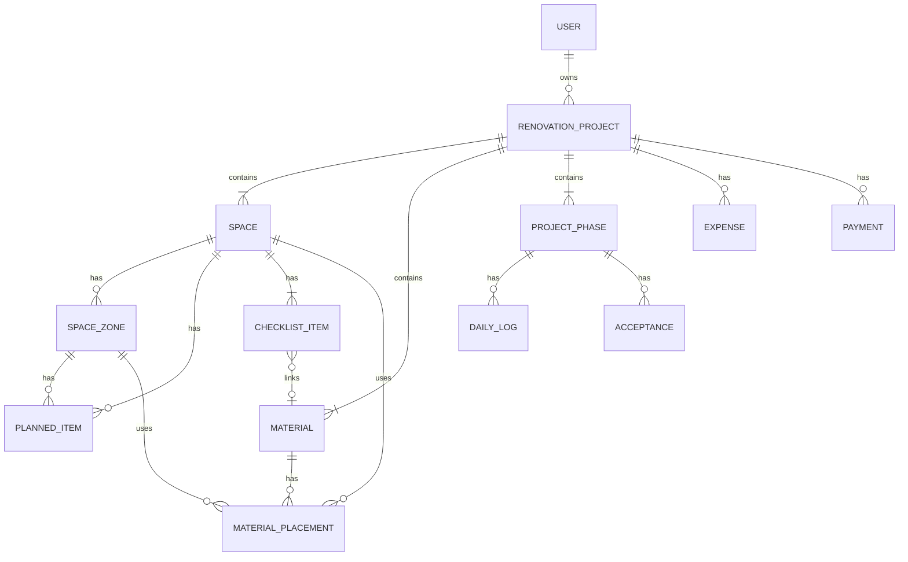

# 业主装修管理系统 — 产品需求文档 (PRD)

> 版本：v1.0 | 日期：2026-07-06 | 状态：Archived（已由 v1.1 取代）
>
> 归档说明：本文件为补齐 MVP 边界 / 状态机 / 预算规则之前的 PRD 快照。现行文档见 `docs/PRD.md`。

---

## 1. 产品概述

### 1.1 背景与目标

业主装修管理系统（以下简称 **Reno**）是一个面向**业主本人**的装修管理工具，帮助业主在装修全过程中系统化地管理空间规划、装修注意事项、建材采购、成本预算与施工进度。

**核心目标：**

- 业主能够系统化规划每个房间的装修方案与注意事项，避免遗漏
- 清晰管理建材采购清单，明确每样建材用在哪里、买了多少、花了多少钱
- 多维度统计装修成本（按空间/品类/阶段），掌控预算不超支
- 记录施工进度与验收情况，装修过程有据可查

### 1.2 用户角色

| 角色               | 说明                                         |
| ------------------ | -------------------------------------------- |
| **业主**           | 系统唯一主用户，管理自己的装修项目全流程     |
| **协作者（可选）** | 业主邀请的家人或设计师，可只读或编辑查看项目 |

> 本系统为业主个人工具，非物业公司 SaaS 平台。无物业审批、巡检、违规等管理环节。

### 1.3 核心价值

| 价值点     | 说明                                           |
| ---------- | ---------------------------------------------- |
| **不遗漏** | 内置各房间装修注意事项模板，系统化避免踩坑     |
| **买得清** | 建材清单管理，明确要买什么、用在哪里、花多少钱 |
| **花得明** | 多维度成本统计，按空间/品类/阶段随时掌握花费   |
| **管得住** | 施工进度与验收记录，装修过程透明可控           |

---

## 2. 核心业务流程

### 2.1 装修准备流程

```
业主创建装修项目（设定地址、风格、预算、工期）
    ↓
创建空间规划（客厅/主卧/厨房/卫生间/阳台...）
    ↓
每个空间内划分分区（如厨房：台面区/烹饪区/洗涤区/储物区）
    ↓
规划家具家电（每个空间/分区放什么、尺寸、预算）
    ↓
从模板初始化装修注意事项 + 自定义补充
    ↓
关联注意事项与建材（如"厨房台面"→ 石英石板材）
```

### 2.2 建材采购流程

```
建立建材清单（名称/品类/规格/品牌/数量/预估价）
    ↓
为每样建材标注使用位置（哪个空间/哪个分区/什么用途）
    ↓
采购状态跟踪：待购 → 已购 → 已到货 → 已安装
    ↓
记录实际采购单价，系统自动计算实际总价
    ↓
费用自动归入成本统计
```

### 2.3 施工与验收流程

```
制定施工计划（拆改→水电→泥木→油漆→安装→软装→保洁）
    ↓
各阶段施工 → 记录施工日志 + 照片
    ↓
阶段完工 → 业主自查验收（对照注意事项清单）
    ↓
全部完工 → 整体回顾与归档
```

### 2.4 成本管理流程

```
设定项目总预算
    ↓
各费用自动/手动归集（建材采购费 + 人工费 + 设计费 + 家具家电费 + 软装费）
    ↓
多维度统计：按空间 / 按品类 / 按阶段 / 按采购状态
    ↓
预算 vs 实际对比 → 超预算预警
    ↓
款项台账：记录付给施工方的各期进度款
```

---

## 3. 功能模块详细设计

### 3.1 项目管理

#### 3.1.1 装修项目

- **创建项目**
  - 项目名称、房屋地址
  - 装修类型：全包 / 半包 / 清包
  - 装修风格（现代简约/北欧/日式/轻奢/...）
  - 装修范围：全屋 / 局部（勾选区域）
  - 总预算设定
  - 预计工期：开工日期 ~ 竣工日期

- **项目概览**
  - 项目状态：规划中 / 施工中 / 验收中 / 已完工 / 已归档
  - 基本信息：地址、类型、风格、工期
  - 进度总览：当前阶段、完成百分比
  - 预算总览：总预算、已花费、剩余、超支预警
  - 采购总览：建材总数、已购数、待购数

### 3.2 空间规划管理

#### 3.2.1 空间管理

- **空间分类**：预设常用空间模板（客厅、餐厅、主卧、次卧、厨房、卫生间、阳台等）
- **自定义空间**：业主可新增自定义空间（如书房、储藏室、衣帽间）
- **空间属性**：
  - 空间名称、面积
  - 装修风格/用途备注
  - 空间照片
  - 关联设计图纸（可选）

#### 3.2.2 空间内分区规划

- 每个空间内可划分多个**分区**（如厨房：台面区、烹饪区、洗涤区、储物区）
- 分区属性：名称、位置描述、尺寸（长×宽×高）、规划说明
- 分区可关联家具家电和建材

#### 3.2.3 家具家电规划

- 在空间或分区内规划家具家电
- 属性：名称、品类、品牌、型号、尺寸、预算单价、状态
- 可关联建材（如"定制衣柜"关联"板材"）
- 状态：待购 / 已购 / 已安装

### 3.3 装修注意事项管理

#### 3.3.1 注意事项维度

- 按**空间维度**管理装修注意事项
- 每条注意事项包含：
  - 所属空间
  - 类别（插座/灯光/水路/防水/收纳/布局/动线/...）
  - 事项内容
  - **避坑提醒**（可选，常见陷阱提示）
  - 状态：待确认 / 已确认 / 已完成 / 需整改
  - 关联建材（可选，如"台面石英石"）
  - 关联施工阶段（可选）

#### 3.3.2 预设模板

系统内置各空间常见注意事项模板：

| 空间       | 类别 | 注意事项                             | 避坑提醒                       |
| ---------- | ---- | ------------------------------------ | ------------------------------ |
| **客厅**   | 插座 | 沙发两侧预留插座（手机充电）         | 沙发尺寸先确认，避免插座被挡   |
|            |      | 电视墙预留 5 孔插座 × 3 + 网线口     | 弱电箱位置需提前规划           |
|            |      | 空调专用 16A 插座                    | 柜机挂机插座位置不同，先定机型 |
|            | 灯光 | 主灯建议无主灯设计（筒灯/射灯）      | 层高 < 2.6m 不建议吊灯         |
|            |      | 阳台与客厅分控开关                   | —                              |
|            | 动线 | 客厅通道宽度 ≥ 80cm                  | 茶几不宜过大，影响通行         |
| **主卧**   | 插座 | 床头两侧双控开关 + USB 插座          | 床头柜高度决定插座位置         |
|            |      | 梳妆台旁预留插座（吹风机/卷发棒）    | —                              |
|            |      | 空调专用 16A 插座（避开床头）        | 空调不宜正对床头               |
|            | 收纳 | 衣柜做到顶，内部按长衣/短衣/叠放分区 | 顶部留 5cm 缝隙易积灰          |
|            | 开关 | 门口 + 床头双控主灯                  | —                              |
| **厨房**   | 插座 | 台面上方预留 4-6 个插座（小家电）    | 带开关，避免频繁拔插           |
|            |      | 冰箱单独回路（长期不断电）           | —                              |
|            |      | 油烟机插座藏于吊顶内                 | —                              |
|            | 水路 | 水槽下方预留净水器/洗碗机水电位      | 提前确认家电型号               |
|            |      | 热水器进出水位置确认                 | —                              |
|            | 布局 | 冰箱→水槽→灶台动线合理（黄金三角）   | 动线总长 3.6-6.6m 最佳         |
| **卫生间** | 插座 | 镜柜旁预留吹风机插座（带防溅盒）     | —                              |
|            |      | 智能马桶旁预留插座（带防溅盒）       | 装修前确认，事后走明线丑       |
|            |      | 洗衣机专用插座                       | —                              |
|            | 防水 | 淋浴区防水高度 ≥ 1.8m                | 防水涂料刷 2-3 遍              |
|            |      | 闭水试验 48 小时                     | 验收必做，拍照留存             |
|            | 排水 | 地漏选择防臭型                       | 淋浴区用深水封地漏             |
|            |      | 地面坡度 ≥ 1%（向地漏方向）          | 坡度不够易积水                 |
| **阳台**   | 插座 | 洗衣机/烘干机专用插座 + 水龙头       | —                              |
|            |      | 预留 1-2 个通用插座                  | —                              |
|            | 防水 | 洗衣机位防水处理                     | —                              |
|            |      | 有排水管接入条件                     | —                              |

#### 3.3.3 模板管理

- 系统维护空间模板库和注意事项模板库
- 业主可基于模板增删改
- 支持按户型快速初始化

### 3.4 建材管理

#### 3.4.1 建材清单

- **建材属性**：
  - 名称、品类（瓷砖/涂料/板材/五金/水电材料/门窗/...）
  - 品牌、规格、单位
  - 计划数量、预估单价、预估总价（自动计算）
  - 实际单价、实际总价（自动计算）
  - 采购状态：待购 / 已购 / 已到货 / 已安装
  - 采购渠道、采购链接
  - 备注

- **品类管理**：支持自定义建材品类，按品类分组查看

#### 3.4.2 建材使用位置管理

- 每样建材可标注**一个或多个使用位置**
- 使用位置属性：
  - 关联空间（如"厨房"）
  - 关联分区（可选，如"台面区"）
  - 具体位置描述（如"厨房台面"）
  - 该位置用量
  - 用途（地面铺贴/墙面/台面/吊顶/...）
- **反向查询**：查看某个空间/分区用到了哪些建材

#### 3.4.3 建材与注意事项关联

- 注意事项可关联建材（如"厨房台面用石英石"→ 关联"石英石板材"）
- 形成完整的 `注意事项 → 建材 → 使用位置` 链路

### 3.5 成本管理

#### 3.5.1 费用记录

- 每笔费用记录：
  - 金额、费用类型（建材/人工/设计/家具家电/软装/其他）
  - 关联空间（可选）
  - 关联建材（可选，自动带入金额）
  - 关联施工阶段（可选）
  - 支付日期、支付方式、备注

#### 3.5.2 多维度成本统计

- **按空间统计**：客厅花了多少、厨房花了多少...
- **按品类统计**：建材类、人工类、设计费...
- **按阶段统计**：拆改阶段、水电阶段...
- **按采购状态统计**：已花费 vs 待支出
- **预算对比**：总预算 vs 已花费 vs 剩余，超预算预警
- 可视化图表：饼图（占比）、柱状图（对比）、趋势图（累计花费）

#### 3.5.3 款项台账

- 记录付给装修公司/施工方的各期进度款
- 属性：付款节点名称、期次、应付金额、已付金额、实付日期、状态
- 帮助业主跟踪工程款支付进度，避免多付/漏付

### 3.6 施工进度管理

#### 3.6.1 施工阶段管理

- 预设阶段模板：拆改 → 水电 → 泥木 → 油漆 → 安装 → 软装 → 保洁
- 每阶段：计划工期、实际工期、状态、进度百分比
- 支持自定义阶段
- 甘特图视图展示整体进度（v1.1）

#### 3.6.2 施工日志

- 业主或协助记录者每日/不定期填写施工日志
  - 施工内容
  - 施工人员
  - 材料使用记录
  - 现场照片/视频
  - 问题与风险
  - 下一步计划

#### 3.6.3 进度看板

- 实时查看施工进展、照片、日志
- 支持时间线视图和照片墙视图（v1.1）

### 3.7 验收管理

#### 3.7.1 阶段验收（业主自查）

- 业主对照注意事项清单进行自查验收
- 验收检查清单（可配置）：
  - 水电验收：打压测试、电路检测
  - 防水验收：闭水试验
  - 泥工验收：平整度、空鼓率
- 验收结果：通过 / 需整改（附照片和说明）
- 整改完成后重新验收

#### 3.7.2 竣工回顾

- 全部阶段通过后触发
- 综合回顾报告生成（v1.1）
- 项目归档

### 3.8 通知与消息

- **系统通知**
  - 采购提醒（待购建材、预计到货）
  - 工期提醒（阶段开始/结束、逾期预警）
  - 验收提醒
  - 预算预警（接近/超出预算）
- **消息渠道**
  - 站内消息（MVP）
  - 浏览器推送（v1.1）

### 3.9 装修知识库（v1.1）

- 装修流程指南（各阶段做什么、注意什么）
- 建材选购指南（各类建材怎么选、价格区间）
- 避坑指南（常见装修陷阱与规避方法）
- 验收标准参考

---

## 4. 数据模型（核心实体）

```
User (用户)
├── id, username, passwordHash, name, phone, avatar
│
├── RenovationProject (装修项目)
│   ├── id, ownerId, name, address
│   ├── type (全包/半包/清包), style, scope
│   ├── totalBudget, plannedStart, plannedEnd
│   └── status (planning/constructing/accepting/completed/archived)
│
├── Space (装修空间)
│   ├── id, projectId, name (客厅/主卧/厨房/...)
│   ├── area, styleNotes, photos[], designDocs[]
│   │
│   ├── SpaceZone (空间分区)
│   │   └── id, spaceId, name, position, dimensions, planNotes
│   │
│   ├── PlannedItem (家具家电规划)
│   │   └── id, spaceId, zoneId?, name, category, brand, model
│   │       dimensions, budgetPrice, status, linkedMaterialId?
│   │
│   └── ChecklistItem (装修注意事项)
│       ├── id, spaceId, category, content, pitfallTip?
│       ├── status (待确认/已确认/已完成/需整改)
│       ├── linkedMaterialId? (关联建材)
│       └── linkedPhaseId? (关联施工阶段)
│
├── Material (建材)
│   ├── id, projectId, name, category, brand, spec, unit
│   ├── plannedQuantity, estimatedPrice, estimatedTotal
│   ├── actualPrice, actualTotal
│   ├── purchaseStatus (待购/已购/已到货/已安装)
│   ├── purchaseChannel, purchaseLink, notes
│   │
│   └── MaterialPlacement (建材使用位置)
│       └── id, materialId, spaceId, zoneId?
│           locationDesc, usageQuantity, purpose
│
├── ProjectPhase (施工阶段)
│   ├── id, projectId, phaseName, sortOrder
│   ├── plannedStart, plannedEnd, actualStart, actualEnd
│   └── status, progressPercent
│
├── DailyLog (施工日志)
│   ├── id, projectId, phaseId, authorId
│   ├── content, materials, workers, photos[]
│   ├── tomorrowPlan, issues
│   └── createdAt
│
├── Acceptance (验收记录)
│   ├── id, projectId, phaseId
│   ├── type (阶段/竣工), checklist[]
│   ├── result (通过/整改), notes, photos[]
│   └── createdAt
│
├── Expense (费用记录)
│   ├── id, projectId, amount, type (建材/人工/设计/家具/软装/其他)
│   ├── spaceId?, materialId?, phaseId?
│   ├── payDate, payMethod, notes
│   └── createdAt
│
├── Payment (款项台账)
│   ├── id, projectId, nodeName, sequence
│   ├── dueAmount, paidAmount, paidDate
│   └── status (待付/已付)
│
└── Notification (通知)
    ├── id, userId, type, title, content
    ├── read, channel
    └── createdAt
```

---

## 5. API 设计

### 5.1 通用响应格式

```typescript
interface ApiResponse<T> {
  code: number; // 0=成功, 非0=错误码
  message: string;
  data: T;
}

interface PaginatedData<T> {
  list: T[];
  total: number;
  page: number;
  pageSize: number;
}
```

### 5.2 认证模块

| 方法 | 路径                      | 说明                      |
| ---- | ------------------------- | ------------------------- |
| POST | `/api/auth/register`      | 用户注册（用户名 + 密码） |
| POST | `/api/auth/login`         | 用户登录                  |
| POST | `/api/auth/token/refresh` | 刷新 JWT Token            |
| GET  | `/api/auth/me`            | 获取当前用户信息          |
| PUT  | `/api/auth/me`            | 更新用户信息              |

### 5.3 项目管理模块

| 方法   | 路径                       | 说明                       |
| ------ | -------------------------- | -------------------------- |
| POST   | `/api/projects`            | 创建装修项目               |
| GET    | `/api/projects`            | 获取项目列表               |
| GET    | `/api/projects/:id`        | 获取项目详情（含概览统计） |
| PUT    | `/api/projects/:id`        | 更新项目信息               |
| POST   | `/api/projects/:id/status` | 更新项目状态               |
| DELETE | `/api/projects/:id`        | 删除项目（归档）           |

### 5.4 空间规划模块

| 方法   | 路径                                          | 说明             |
| ------ | --------------------------------------------- | ---------------- |
| POST   | `/api/projects/:id/spaces`                    | 创建空间         |
| GET    | `/api/projects/:id/spaces`                    | 获取空间列表     |
| PUT    | `/api/spaces/:id`                             | 更新空间信息     |
| DELETE | `/api/spaces/:id`                             | 删除空间         |
| POST   | `/api/spaces/:id/zones`                       | 创建空间内分区   |
| GET    | `/api/spaces/:id/zones`                       | 获取分区列表     |
| PUT    | `/api/zones/:id`                              | 更新分区         |
| DELETE | `/api/zones/:id`                              | 删除分区         |
| POST   | `/api/spaces/:id/items`                       | 添加家具家电规划 |
| GET    | `/api/spaces/:id/items`                       | 获取家具家电列表 |
| PUT    | `/api/items/:id`                              | 更新家具家电     |
| DELETE | `/api/items/:id`                              | 删除家具家电     |
| POST   | `/api/projects/:id/spaces/init-from-template` | 从模板初始化空间 |

### 5.5 装修注意事项模块

| 方法   | 路径                                             | 说明                                             |
| ------ | ------------------------------------------------ | ------------------------------------------------ |
| POST   | `/api/spaces/:id/checklist`                      | 添加注意事项                                     |
| GET    | `/api/spaces/:id/checklist`                      | 获取空间注意事项列表                             |
| GET    | `/api/projects/:id/checklist`                    | 获取项目全部注意事项（支持按空间/类别/状态筛选） |
| PUT    | `/api/checklist/:id`                             | 更新注意事项                                     |
| PUT    | `/api/checklist/:id/status`                      | 更新注意事项状态                                 |
| DELETE | `/api/checklist/:id`                             | 删除注意事项                                     |
| POST   | `/api/projects/:id/checklist/init-from-template` | 从模板初始化注意事项                             |

### 5.6 建材管理模块

| 方法   | 路径                            | 说明                                     |
| ------ | ------------------------------- | ---------------------------------------- |
| POST   | `/api/projects/:id/materials`   | 添加建材                                 |
| GET    | `/api/projects/:id/materials`   | 获取建材列表（支持按品类/状态/空间筛选） |
| GET    | `/api/materials/:id`            | 获取建材详情（含使用位置）               |
| PUT    | `/api/materials/:id`            | 更新建材信息                             |
| PUT    | `/api/materials/:id/status`     | 更新采购状态                             |
| DELETE | `/api/materials/:id`            | 删除建材                                 |
| POST   | `/api/materials/:id/placements` | 添加建材使用位置                         |
| GET    | `/api/materials/:id/placements` | 获取建材使用位置列表                     |
| PUT    | `/api/placements/:id`           | 更新使用位置                             |
| DELETE | `/api/placements/:id`           | 删除使用位置                             |
| GET    | `/api/spaces/:id/materials`     | 查询空间使用的建材（反向查询）           |

### 5.7 成本管理模块

| 方法   | 路径                                         | 说明                                     |
| ------ | -------------------------------------------- | ---------------------------------------- |
| POST   | `/api/projects/:id/expenses`                 | 添加费用记录                             |
| GET    | `/api/projects/:id/expenses`                 | 获取费用列表（支持按类型/空间/阶段筛选） |
| PUT    | `/api/expenses/:id`                          | 更新费用记录                             |
| DELETE | `/api/expenses/:id`                          | 删除费用记录                             |
| GET    | `/api/projects/:id/cost-summary`             | 获取成本汇总（多维度统计）               |
| GET    | `/api/projects/:id/cost-summary/by-space`    | 按空间维度统计                           |
| GET    | `/api/projects/:id/cost-summary/by-category` | 按品类维度统计                           |
| GET    | `/api/projects/:id/cost-summary/by-phase`    | 按阶段维度统计                           |
| POST   | `/api/projects/:id/payments`                 | 添加款项记录                             |
| GET    | `/api/projects/:id/payments`                 | 获取款项列表                             |
| PUT    | `/api/payments/:id`                          | 更新款项记录                             |

### 5.8 施工阶段模块

| 方法 | 路径                       | 说明              |
| ---- | -------------------------- | ----------------- |
| POST | `/api/projects/:id/phases` | 创建/更新施工计划 |
| GET  | `/api/projects/:id/phases` | 获取阶段列表      |
| PUT  | `/api/phases/:id/status`   | 更新阶段状态      |
| POST | `/api/phases/:id/complete` | 标记阶段完工      |

### 5.9 施工日志模块

| 方法 | 路径                     | 说明                                |
| ---- | ------------------------ | ----------------------------------- |
| POST | `/api/projects/:id/logs` | 提交施工日志                        |
| GET  | `/api/projects/:id/logs` | 获取日志列表（支持按阶段/日期筛选） |
| POST | `/api/uploads/image`     | 上传图片（返回 URL）                |

### 5.10 验收模块

| 方法 | 路径                   | 说明         |
| ---- | ---------------------- | ------------ |
| POST | `/api/acceptances`     | 发起验收     |
| GET  | `/api/acceptances/:id` | 获取验收详情 |
| PUT  | `/api/acceptances/:id` | 更新验收结果 |

---

## 6. 技术架构规划

### 6.1 Monorepo 结构

```
reno/
├── apps/
│   ├── web/          → 业主端 Web 应用（React 19 + shadcn/ui）
│   ├── mobile/       → 移动端（可选，后期适配）
│   └── server/       → API 服务（Hono + TypeScript）
├── packages/
│   ├── shared/       → 共享 Zod schema、类型、枚举、常量
│   ├── utils/        → 通用工具函数
│   ├── db/           → 数据库 schema、迁移（Drizzle ORM）
│   └── ui/           → 共享 UI 组件（可选）
└── docs/
    └── PRD.md
```

### 6.2 技术选型

| 层       | 方案                                                   |
| -------- | ------------------------------------------------------ |
| 前端     | React 19 + TypeScript + shadcn/ui + Tailwind CSS 4     |
| 后端     | Hono + TypeScript                                      |
| 数据库   | PostgreSQL 17                                          |
| ORM      | Drizzle ORM                                            |
| 校验     | Zod（前后端共享 schema，契约即代码）                   |
| 文件存储 | 本地存储（开发）/ 对象存储（生产，阿里云 OSS / MinIO） |
| 认证     | JWT（用户名 + 密码，argon2id 哈希）                    |
| 部署     | Docker + 1Panel                                        |

> 详细技术架构与版本锁定见 `docs/ARCHITECTURE.md`。

---

## 7. 版本规划

### MVP (v1.0) — 核心功能

- [ ] 用户注册/登录（用户名 + 密码）
- [ ] 装修项目创建与管理
- [ ] 空间管理 + 空间内分区规划
- [ ] 家具家电规划
- [ ] 装修注意事项管理（模板 + 自定义）
- [ ] 建材清单管理
- [ ] 建材使用位置管理
- [ ] 成本记录与多维度统计
- [ ] 施工阶段管理与日志
- [ ] 阶段验收（业主自查）
- [ ] 基础通知（站内消息）

### v1.1 — 体验增强

- [ ] 建材采购看板与提醒
- [ ] 成本可视化图表（饼图/柱状图/趋势图）
- [ ] 施工进度甘特图
- [ ] 装修知识库（流程指南/选购指南/避坑指南）
- [ ] 照片墙与时间线视图

### v1.2 — 扩展功能

- [ ] 移动端适配 / 响应式优化
- [ ] 款项台账管理
- [ ] 数据导出（PDF 报告 / Excel）
- [ ] 项目归档与历史回顾
- [ ] 邀请协作者（家人/设计师只读查看）

### v2.0 — 智能化（远期）

- [ ] 基于户型的智能注意事项推荐
- [ ] 建材用量自动估算（按面积×损耗系数）
- [ ] 装修预算智能分配建议
- [ ] 周边建材市场/服务商推荐（可选）

---

## 8. 非功能需求

| 项目     | 要求                                                            |
| -------- | --------------------------------------------------------------- |
| 性能     | API 响应 < 200ms（P95），页面加载 < 2s                          |
| 可用性   | 99.5% SLA                                                       |
| 安全     | HTTPS、JWT 鉴权、密码 argon2id 哈希、数据脱敏、文件上传类型校验 |
| 兼容性   | Chrome/Edge/Safari 最新版，移动端 H5 兼容                       |
| 存储     | 图片压缩后上传（sharp 转 webp），单文件限制 20MB                |
| 数据备份 | 数据库每日自动备份                                              |

---

## 9. UI/UX 设计原则

### 9.1 整体风格

- **设计语言**：简洁、温暖、专业，参考家居类应用风格
- **配色方案**：主色使用蓝色系（#1677ff）或绿色系（自然/家居感），辅以暖灰色背景
- **布局**：响应式，桌面端左侧菜单 + 内容区，移动端底部 Tab + 内容区

### 9.2 核心页面

| 页面     | 说明                                                       |
| -------- | ---------------------------------------------------------- |
| 工作台   | 项目概览、待办事项、采购提醒、预算状态、进度一览           |
| 空间规划 | 空间列表 → 空间详情（分区 + 家具家电 + 注意事项 Tab 切换） |
| 建材管理 | 建材清单（按状态/品类分组）→ 建材详情（含使用位置）        |
| 成本中心 | 多维度统计看板 + 费用记录列表                              |
| 施工进度 | 甘特图 + 时间线 + 照片墙                                   |
| 验收管理 | 验收清单 + 验收记录                                        |

### 9.3 交互规范

- 表单：实时校验、必填项标记、提交前二次确认
- 列表：支持排序、筛选、分组
- 提示：操作成功/失败 Toast，危险操作二次确认
- 加载：骨架屏 + Loading 状态
- 移动端：大按钮、底部操作栏、手势返回

---

## 10. 数据库设计

### 10.1 ER 关系图



### 10.2 核心表结构

#### user 用户表

| 字段          | 类型         | 说明                   |
| ------------- | ------------ | ---------------------- |
| id            | UUID         | 主键                   |
| username      | VARCHAR(50)  | 用户名（唯一，登录用） |
| password_hash | VARCHAR(255) | 密码哈希（argon2id）   |
| name          | VARCHAR(50)  | 姓名                   |
| phone         | VARCHAR(20)  | 手机号（可选）         |
| avatar        | VARCHAR(255) | 头像 URL               |
| created_at    | TIMESTAMP    | 创建时间               |
| updated_at    | TIMESTAMP    | 更新时间               |

#### renovation_project 装修项目表

| 字段          | 类型          | 说明                                               |
| ------------- | ------------- | -------------------------------------------------- |
| id            | UUID          | 主键                                               |
| owner_id      | UUID          | 业主 ID                                            |
| name          | VARCHAR(100)  | 项目名称                                           |
| address       | VARCHAR(255)  | 房屋地址                                           |
| type          | ENUM          | full/half/clear                                    |
| style         | VARCHAR(50)   | 装修风格                                           |
| scope         | TEXT          | 装修范围                                           |
| total_budget  | DECIMAL(12,2) | 总预算                                             |
| planned_start | DATE          | 计划开工                                           |
| planned_end   | DATE          | 计划完工                                           |
| status        | ENUM          | planning/constructing/accepting/completed/archived |
| created_at    | TIMESTAMP     | 创建时间                                           |
| updated_at    | TIMESTAMP     | 更新时间                                           |

#### space 装修空间表

| 字段        | 类型          | 说明              |
| ----------- | ------------- | ----------------- |
| id          | UUID          | 主键              |
| project_id  | UUID          | 项目 ID           |
| name        | VARCHAR(50)   | 空间名称          |
| area        | DECIMAL(10,2) | 面积（m²）        |
| style_notes | TEXT          | 风格/用途备注     |
| photos      | JSON          | 空间照片 URL 数组 |
| design_docs | JSON          | 设计图纸 URL 数组 |

#### space_zone 空间分区表

| 字段       | 类型         | 说明                |
| ---------- | ------------ | ------------------- |
| id         | UUID         | 主键                |
| space_id   | UUID         | 空间 ID             |
| name       | VARCHAR(50)  | 分区名称            |
| position   | VARCHAR(100) | 位置描述            |
| dimensions | VARCHAR(50)  | 尺寸（长×宽×高 cm） |
| plan_notes | TEXT         | 规划说明            |

#### planned_item 家具家电规划表

| 字段               | 类型          | 说明                        |
| ------------------ | ------------- | --------------------------- |
| id                 | UUID          | 主键                        |
| space_id           | UUID          | 空间 ID                     |
| zone_id            | UUID          | 分区 ID（可选）             |
| name               | VARCHAR(100)  | 名称                        |
| category           | VARCHAR(50)   | 品类                        |
| brand              | VARCHAR(100)  | 品牌（可选）                |
| model              | VARCHAR(100)  | 型号（可选）                |
| dimensions         | VARCHAR(50)   | 尺寸                        |
| budget_price       | DECIMAL(10,2) | 预算单价                    |
| status             | ENUM          | pending/purchased/installed |
| linked_material_id | UUID          | 关联建材 ID（可选）         |

#### checklist_item 注意事项表

| 字段               | 类型        | 说明                                      |
| ------------------ | ----------- | ----------------------------------------- |
| id                 | UUID        | 主键                                      |
| space_id           | UUID        | 空间 ID                                   |
| category           | VARCHAR(50) | 类别（插座/灯光/水路/防水/收纳/布局/...） |
| content            | TEXT        | 事项内容                                  |
| pitfall_tip        | TEXT        | 避坑提醒（可选）                          |
| status             | ENUM        | pending/confirmed/completed/rectification |
| linked_material_id | UUID        | 关联建材 ID（可选）                       |
| linked_phase_id    | UUID        | 关联施工阶段 ID（可选）                   |

#### material 建材表

| 字段             | 类型          | 说明                                  |
| ---------------- | ------------- | ------------------------------------- |
| id               | UUID          | 主键                                  |
| project_id       | UUID          | 项目 ID                               |
| name             | VARCHAR(100)  | 建材名称                              |
| category         | VARCHAR(50)   | 品类                                  |
| brand            | VARCHAR(100)  | 品牌                                  |
| spec             | VARCHAR(100)  | 规格                                  |
| unit             | VARCHAR(20)   | 单位                                  |
| planned_quantity | DECIMAL(10,2) | 计划数量                              |
| estimated_price  | DECIMAL(10,2) | 预估单价                              |
| estimated_total  | DECIMAL(12,2) | 预估总价（自动计算）                  |
| actual_price     | DECIMAL(10,2) | 实际单价                              |
| actual_total     | DECIMAL(12,2) | 实际总价（自动计算）                  |
| purchase_status  | ENUM          | pending/purchased/delivered/installed |
| purchase_channel | VARCHAR(100)  | 采购渠道                              |
| purchase_link    | VARCHAR(500)  | 采购链接                              |
| notes            | TEXT          | 备注                                  |

#### material_placement 建材使用位置表

| 字段           | 类型          | 说明                           |
| -------------- | ------------- | ------------------------------ |
| id             | UUID          | 主键                           |
| material_id    | UUID          | 建材 ID                        |
| space_id       | UUID          | 空间 ID                        |
| zone_id        | UUID          | 分区 ID（可选）                |
| location_desc  | VARCHAR(200)  | 具体位置描述                   |
| usage_quantity | DECIMAL(10,2) | 该位置用量                     |
| purpose        | VARCHAR(100)  | 用途（地面铺贴/墙面/台面/...） |

#### project_phase 施工阶段表

| 字段             | 类型        | 说明                                   |
| ---------------- | ----------- | -------------------------------------- |
| id               | UUID        | 主键                                   |
| project_id       | UUID        | 项目 ID                                |
| phase_name       | VARCHAR(50) | 阶段名称                               |
| sort_order       | INT         | 排序                                   |
| status           | ENUM        | pending/in_progress/completed/accepted |
| planned_start    | DATE        | 计划开始                               |
| planned_end      | DATE        | 计划结束                               |
| actual_start     | DATE        | 实际开始                               |
| actual_end       | DATE        | 实际结束                               |
| progress_percent | INT         | 进度百分比                             |

#### daily_log 施工日志表

| 字段          | 类型         | 说明          |
| ------------- | ------------ | ------------- |
| id            | UUID         | 主键          |
| project_id    | UUID         | 项目 ID       |
| phase_id      | UUID         | 阶段 ID       |
| author_id     | UUID         | 作者 ID       |
| content       | TEXT         | 施工内容      |
| materials     | JSON         | 材料使用记录  |
| workers       | VARCHAR(200) | 施工人员      |
| photos        | JSON         | 照片 URL 数组 |
| tomorrow_plan | TEXT         | 明日计划      |
| issues        | TEXT         | 问题与风险    |
| created_at    | TIMESTAMP    | 创建时间      |

#### expense 费用记录表

| 字段        | 类型          | 说明                                          |
| ----------- | ------------- | --------------------------------------------- |
| id          | UUID          | 主键                                          |
| project_id  | UUID          | 项目 ID                                       |
| amount      | DECIMAL(12,2) | 金额                                          |
| type        | ENUM          | material/labor/design/furniture/softfit/other |
| space_id    | UUID          | 关联空间 ID（可选）                           |
| material_id | UUID          | 关联建材 ID（可选）                           |
| phase_id    | UUID          | 关联阶段 ID（可选）                           |
| pay_date    | DATE          | 支付日期                                      |
| pay_method  | VARCHAR(50)   | 支付方式                                      |
| notes       | TEXT          | 备注                                          |
| created_at  | TIMESTAMP     | 创建时间                                      |

#### payment 款项台账表

| 字段        | 类型          | 说明         |
| ----------- | ------------- | ------------ |
| id          | UUID          | 主键         |
| project_id  | UUID          | 项目 ID      |
| node_name   | VARCHAR(100)  | 付款节点名称 |
| sequence    | INT           | 期次排序     |
| due_amount  | DECIMAL(12,2) | 应付金额     |
| paid_amount | DECIMAL(12,2) | 已付金额     |
| paid_date   | DATE          | 实付日期     |
| status      | ENUM          | pending/paid |

---

## 11. 安全设计

### 11.1 认证与授权

- **JWT Token**：Access Token (2h) + Refresh Token (7d)，Refresh 轮换
- **密码哈希**：argon2id
- **权限模型**：业主拥有自己项目的全部权限；受邀协作者由业主授权（只读/编辑）

### 11.2 数据安全

- 敏感数据（手机号）脱敏显示
- 文件上传限制：类型白名单（jpg/jpeg/png/webp）、大小限制 20MB
- 操作日志：记录关键操作（创建/修改/删除）
- 数据隔离：业主只能访问自己的项目数据

---

## 12. 开放问题

| #   | 问题                   | 优先级 | 说明                                   |
| --- | ---------------------- | ------ | -------------------------------------- |
| 1   | 是否需要移动端 App？   | 中     | MVP 先做 Web 响应式，后续评估          |
| 2   | 建材模板库是否预置？   | 中     | 可内置常用建材品类模板，业主快速添加   |
| 3   | 是否支持多项目？       | 低     | 业主可能有多套房装修，MVP 先支持单项目 |
| 4   | 数据导出格式？         | 低     | PDF 报告 / Excel，v1.1 实现            |
| 5   | 是否集成建材电商链接？ | 低     | 可选功能，跳转购物平台                 |

---

_文档由 Reno 项目团队维护，版本 v1.0，2026-07-06。归档副本。_
